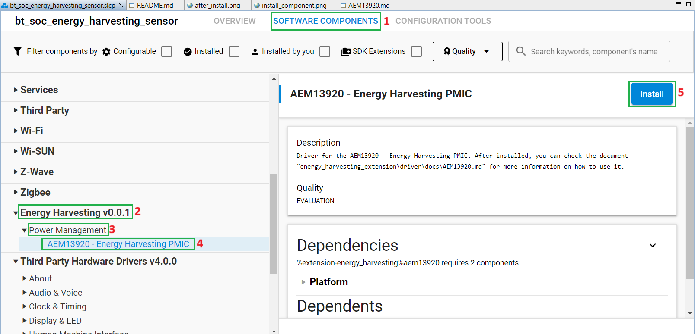
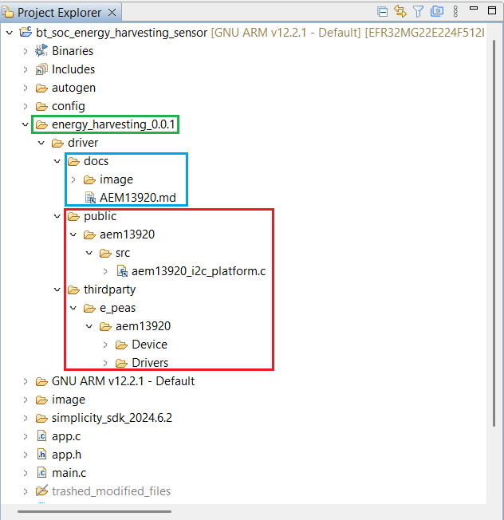
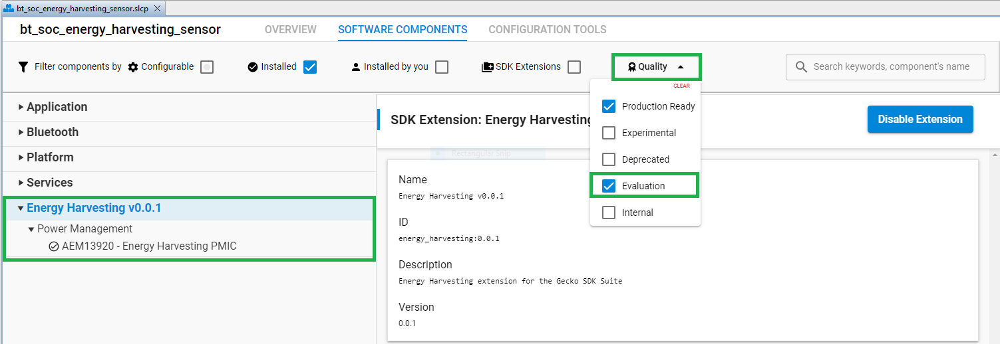

# AEM13920 - Energy Harvesting PMIC #

## How To Install Component ##

1. Install Enegery Harvesting Extension first. Follow guideline [How to add to Simplicity Studio IDE](https://github.com/SiliconLabs/energy_harvesting_applications?tab=readme-ov-file#how-to-add-to-simplicity-studio-ide)

2. After successfully installing Energy Harvesting Extension, you can easily find and install this component:

    - Open the *.slcp file in the project.

    - Select the SOFTWARE COMPONENTS tab.

    - Install the following components:

        - [Energy Harvesting v1.0.0] → [Power Management] → [AEM13920 - Energy Harvesting PMIC]

            

        - After installing the component successfully, you can see the generated code as below:

            

> NOTE: Make sure that the user changes the quality filter by checking the checkbox for the evaluation components in the quality filter view, so the user can see the SOFTWARE COMPONENTS component listed. After that, the Enegery Harvesting Extension must be enabled for the project to install the "AEM13920 - Energy Harvesting PMIC" component.



## How To Use ##

### Initialization Sequence ###

#### Reset Sequence ####

Before starting to use this driver, one needs to make sure the AEM is out of its reset sequence and ready to communicate. To do so, the IRQ pin can be used, as explained in the datasheet, section 8.1.2. Throughout this document, this condition will be considered verified.

#### I2C Communication Interface ####

The interface requires a data structure to be set with information about the I2C communication configuration, which must be passed as an argument to every of this driver's functions. The "AEM_i2c_cfg" data structure is defined as below:

```C
/**
  * @struct  AEM_i2c_cfg
  * @brief  Communication interface's required information
  */
typedef struct _AEM_i2c_cfg {
 /** 
  * @brief  A function callback
  * 
  * @note  Use NULL if no callback should be used
  */
 void (*usr_callback) (int32_t event);
 /** 
  * @brief  The index of the interface to be used 
  * 
  * When multiple I2C interfaces are available, set this field with the 
  * index of the interface to be used 
  */
 uint32_t interface;
 /**
   * @brief  The AEM's slave address
   * 
   * Set this field with the device's slave address
   */
 uint32_t slaveAddress;
} AEM_i2c_cfg;

```

The user must use the "AEM_i2c_cfg" data structure to define the I2C interface as below:

```C
const AEM_i2c_cfg aem13920 = {
  .usr_callback = NULL,
  .interface = (uint32_t) SL_I2CSPM_MIKROE_PERIPHERAL,
  .slaveAddress = AEM13920_I2CSLAVE_ADDRESS
};
```

#### Initialization ####

Once the I2C interface is correctly configured, a call to the AEM13920_Initialize() function will allow to initialize the interface, and the driver will then be ready to be used.

```C
AEM13920_Initialize(&aem13920);
```

### Configuring The AEM13920 ###

There are two ways to configure parameters for the AEM13920 PMIC. It is the use of hardware or software. Since the boards are already hardware configured from the time of manufacture, they do not need to be configured anymore, unless the user wants to change them. Here are two ways how to change those parameters using software.

#### First alternative ####

The AEM needs to be completely configured. In that case a AEM13920_Config variable must be declared and set according to the desired configuration. Then, passing this variable to the function AEM13920_Configure() will update the AEM behavior accordingly. This alternative will reduce the overhead related to the communication interface: a single transfer will set the entire configurable area of the I2C registers (bulk transfer), and trigger the synchronization of the system registers along the way. See the below example:

```C
AEM_i2c_cfg my_aem_i2c_cfg; 
my_aem_i2c_cfg.usr_callback = my_callback;
my_aem_i2c_cfg.interface = 0;
my_aem_i2c_cfg.slaveAddress = AEM13920_I2CSLAVE_ADDRESS;
 
AEM13920_Config my_aem_cfg;
 
// Fill in the value in mV, so that the temperature thresholds can be computed
my_aem_cfg.Rdiv = 22000000;
 
// Get the current configuration (i.e. reset values)
AEM13920_GetConfiguration(&my_aem_i2c_cfg, &my_aem_cfg);
 
// Set the data structure with the required configuration settings
my_aem_cfg.src2ReguMode = AEM13920_SRCREGU_CONST;
my_aem_cfg.src2ReguV = 1900;
 
my_aem_cfg.apmMode = AEM13920_APM_MODE_POWER_METER;
my_aem_cfg.apmWindow = AEM13920_APM_WINDOW_128;
my_aem_cfg.enableAPMSRC2 = true;
 
my_aem_cfg.enableHPBoost2 = true;
 
my_aem_cfg.irq.enableDischarge = true;
my_aem_cfg.irq.enableOvercharge = true;
my_aem_cfg.irq.enableAPMDone = true;
my_aem_cfg.irq.enableOutOfReset = true;
 
// ...
 
// Load the configuration into the registers, and update the AEM
AEM13920_Configure(&my_aem_i2c_cfg, &my_aem_cfg);
```

#### Second alternative ####

Only some specific configuration elements need to be updated. In this case, the relevant SetXXX, EnableXXX, or DisableXXX functions can be called. That way, only the relevant registers will be written. Then, the AEM13920_LoadConfiguration() function should be called so that the system registers are synchronized with the configuration set into the I2C registers. See the below example:

```C
AEM_i2c_cfg my_aem_i2c_cfg; 
my_aem_i2c_cfg.usr_callback = my_callback;
my_aem_i2c_cfg.interface = 0;
my_aem_i2c_cfg.slaveAddress = AEM13920_I2CSLAVE_ADDRESS;
 
// Only set the temperature monitoring feature
AEM13920_EnableTemperatureMonitoring(&my_aem_i2c_cfg);
 
// Update the AEM accordingly
AEM13920_LoadConfiguration(&my_aem_i2c_cfg);
```

### Reading The Configuration Of The AEM13920 ###

> NOTE:
> Please note that when using this driver's functions to read the AEM's configuration, the functions return the configuration set into the I2C registers. If some changes have been made using the AEM13920_SetXXX, AEM13920_EnableXXX, or AEM13920_DisableXXX functions without a subsequent call to AEM13920_LoadConfiguration(), the values returned by the functions AEM13920_GetXXX might not reflect the actual configuration of the AEM.

This driver provides two ways of retrieving the configuration of the AEM13920:

#### First alternative ####

A series of configuration settings need to be checked. In that case, it might be more efficient to read all the configuration areas in a single transaction (bulk transfer), and then to interrogate the specific settings. To do so, a call to AEM13920_GetConfiguration() will set the user's data structure, and the user will only have to read the relevant fields to retrieve the required information. See the below example:

```C
AEM13920_Config my_aem_cfg;
 
my_aem_cfg.Rdiv = 22000000; /* Fill in the correct value, in mOhms, so that the temperature thresholds can be computed */
 
AEM13920_GetConfiguration(&my_aem_i2c_cfg, &my_aem_cfg);
  if (my_aem_cfg.enableAPMDone) {
        // ...
}
 
if (my_aem_cfg.irq.enableDischarge) {
        // ...
}
```

#### Second alternative ####

Only a few number of settings need to be checked. In this case, the GetXXX functions can be called. That way, only the relevant registers will be read to retrieve the required information. See the below example:

```C
bool tempMonEn = false;
AEM13920_GetTempMonEnable(&my_aem_i2c_cfg, &tempMonEn);
if (tempMonEn) { 
        // ...
}
 
AEM13920_IRQEN my_aem_irqs;
AEM13920_GetIRQConfiguration(&my_aem_i2c_cfg, &my_aem_irqs);
if (my_aem_irqs.enableDischarge) {
        // ...
}
```

### Reading The Data Of The AEM13920 ###

Various functions can be used to retrieve the generated data from AEM13920. See the example below:

```C
int32_t AEM13920_GetAPMDataSRC( const AEM_i2c_cfg *i2cCfg, AEM13920_Source src, uint32_t *data, uint32_t *offset);

int32_t AEM13920_GetAPMDataBuck(const AEM_i2c_cfg *i2cCfg, uint32_t *data, uint32_t *offset);

int32_t AEM13920_GetAPMError(const AEM_i2c_cfg *i2cCfg, AEM13920_APMERR *apmErr);

int32_t AEM13920_GetThermistorZ(const AEM_i2c_cfg *i2cCfg, uint32_t *Rth, uint32_t Rdiv);

int32_t AEM13920_GetSourceRegulationVoltage( const AEM_i2c_cfg *i2cCfg, AEM13920_Source src, uint32_t *Vsrc);

int32_t AEM13920_GetStorageVoltage(const AEM_i2c_cfg *i2cCfg, uint32_t *Vsto);
```
