# Bluetooth RAIL - Energy Harvesting Kinetic Switch #

## Overview ##

This project aims to implement a wireless switch device, which is intended to be used with the xG22E Explorer Kit and Kinetic Harvester Shield, an add-on board with an integrated Kinetic Switch Power source and a Power Management IC from e-peas. The wireless SoC is normally in a de-energized state. When the Kinetic Switch is pushed, the device is momentarily powered by the kinetic energy harvester, allowing it to transmit advertising packets until the energy is depleted and the device powers off again. Packets transmitted by this example application contain the device name.

## Table Of Contents ##

- [Purpose/Scope](#purposescope)
- [Prerequisites](#prerequisites)
  - [Hardware Requirements](#hardware-requirements)
  - [Software Requirements](#software-requirements)
- [Steps to Run Demo Application](#steps-to-run-demo-application)
  - [Create a project based on an example project](#create-a-project-based-on-an-example-project)
  - [Testing with observer application](#testing-with-observer-application)
  - [Testing with mobile phone](#testing-with-mobile-phone)
- [Resources](#resources)
- [Report Bugs & Get Support](#report-bugs--get-support)

## Purpose/Scope ##

### Application Overview ###

The overview of this application is shown in the image below:

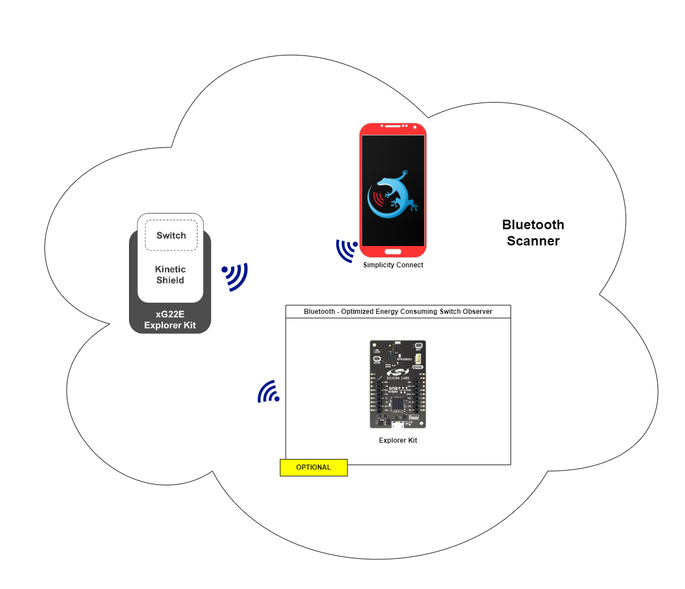

The **Kinetic Switch Shield** is the main power source for this application, which is a battery-less application. When the switch is pushed, it will provide a limited amount of energy, therefore the application shall be optimized to transmit only the minimal required information within the shortest feasible time slot.

When the switch is pushed, the circuit is energized, the SoC powers up and sends multiple advertising packets. It will keep sending until the energy stored in the decoupling capacitors of the SoC is depleted and a brown-out reset occurs. Until then, one might see at least 3 advertising packets being received by the observer device. The advertising packets can be used to trigger a change of state in the observer, for example to control a LED or a power switch.

**Operating the kinetic switch:** for optimal performance, it is important to push the actuator lever firmly and quickly release it, to allow the magnetic rod to return to its original position and generate the second energy pulse without obstruction. For more details, please refer to section 4.3 in UG591.

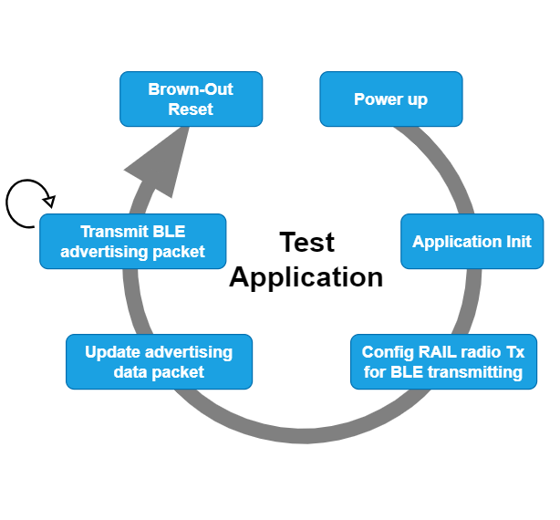

### BLE advertisement packet ###

To keep the minimum energy usage, We are using RAIL to generate the advertisement packets instead of bluetooth stack. The advertisement packet structure is as the picture below

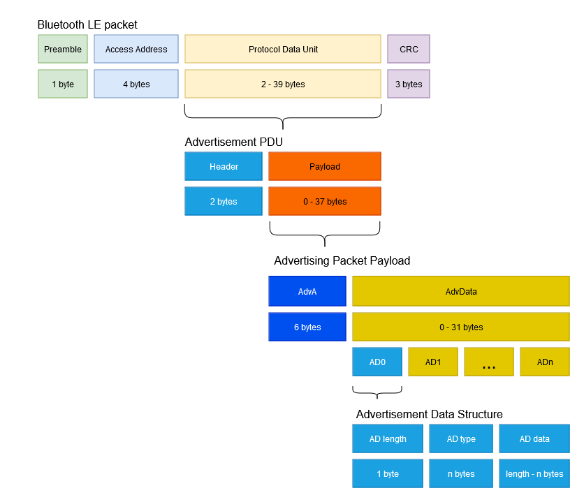

As per Bluetooth 4.0 specification, we need to set up RAIL for basic BLE advertising with access address is 0x8E89BED6 and CRC initialization value is 0x555555. The Advertisement header is set to 0x02, which is non-connectable undirected advertising.

In this application, the BLE advertisement data packet contains 3 types of advertisement data structure:

**Flags**

| Data length | Type | Flags | Description |
| --- | --- | --- | --- |
|  2 bytes  | 0x01 | 0x06 | Flags: LE General Discoverable Mode, BR/EDR Not Supported |

**Manufacturer specific**

| Data length | Type | Manufacturer ID | Description |
| --- | --- | --- | --- |
|  3 bytes | 0xff  | 0x02FF | The Company Identifier is a 16-bit value assigned by the Bluetooth Special Interest Group (SIG) |

**Complete local name**

| Data length | Type | Data | Description |
| --- | --- | --- | --- |
|  10 bytes | 0x09  | "EH Switch" | Data: Device local name |

## Prerequisites ##

### Hardware Requirements ###

For the *switch* device

- xG22-EK8200A EFR32xG22E Energy Harvesting Explorer Kit
  - 1x BRD2710A - EFR32xG22E Explorer Board
  - 1x BRD8202A - Kinetic Button Shield, with e-peas PMIC AEM00300

For the *observer* device, there are no specific requirements for the Observer. For simplicity, Silicon Labs recommends either the BGM220-EK4314A or xG24-EK2703A Explorer Kits.

#### Hardware Connections ####

The Silicon Labs - Kinetic Energy Harvesting Shield (BRD8202A) is connected on top of the MikroBus header of the EFR32xG22E Explorer Kit (BRD2710A). Make sure that the 45-degree corner of the Silicon Labs - Kinetic Energy Harvesting Shield matches the 45-degree white line of the EFR32xG22E Explorer Kit.

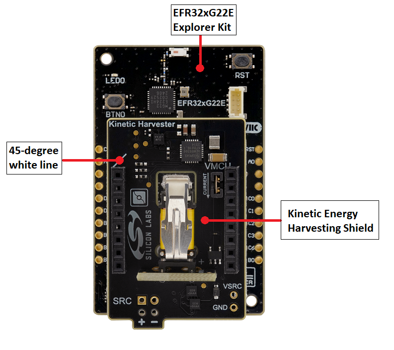

### Software Requirements ###

- Simplicity Studio
  - Download the [Simplicity Studio v5 IDE](https://www.silabs.com/developers/simplicity-studio)
  - Follow the [Simplicity Studio User Guide](https://docs.silabs.com/simplicity-studio-5-users-guide/1.1.0/ss-5-users-guide-getting-started/install-ss-5-and-software#install-ssv5) to install Simplicity Studio IDE
- [Simplicity SDK Version 2024.12.2](https://github.com/SiliconLabs/simplicity_sdk/releases/tag/v2024.12.2)
- [Energy Harvesting Applications Extension](https://github.com/SiliconLabs/energy_harvesting_applications), follow the [How to add to Simplicity Studio IDE](../../README.md#how-to-add-to-simplicity-studio-ide) to install the extension.
- Simplicity Connect Mobile Application [(iOS)](https://apps.apple.com/us/app/simplicity-connect/id1030932759) or [(Android)](https://play.google.com/store/apps/details?id=com.siliconlabs.bledemo&hl=en_NZ)

## Steps to Run Demo Application ##

### Create a project based on an example project ###

To test this application, you can create a project in Simplicity Studio by selecting the example project: "Bluetooth RAIL - SoC Energy Harvesting Kinetic Switch".

1. In Simplicity Studio, from the Launcher Home, add your hardware to My Products, click on it, and click on the **EXAMPLE PROJECTS & DEMOS** tab. Find the example project filtering by "energy harvesting".

2. Click **_Create_** button on the project:

   - **Bluetooth RAIL - SoC Energy Harvesting Kinetic Switch** example for switch device
   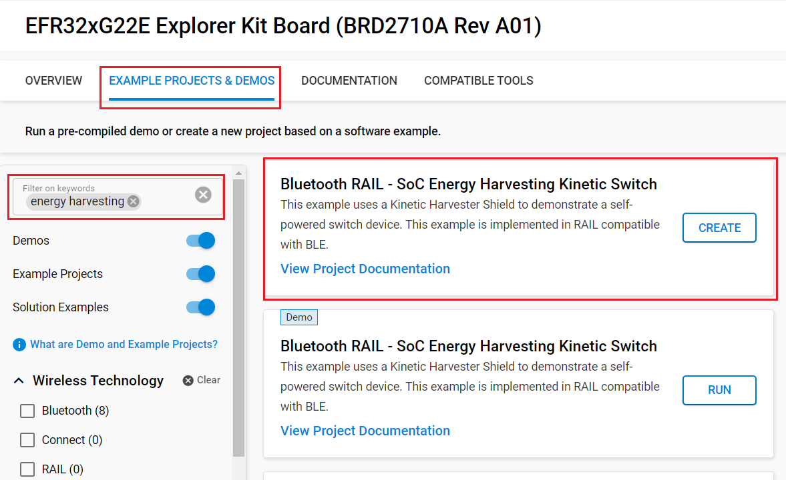

   - Example project creation dialog pops up -> click **_Create_** and Finish and Project should be generated.

3. Build and flash these examples to boards.

> **_NOTE:_**
This demo needs a light application, which is located at **example/bt_soc_energy_harvesting_application_observer** in this repository. The *observer* device has a LED, which is controlled by the *switch* device. You also can monitor the *switch* event data by using the **Simplicity Connect Mobile App** for mobile phone (IOS or Android).

### Testing with observer application ###

#### Create an *observer* application demo ####

1. Connect the observer device to the computer by using a USB cable.
2. In Simplicity Studio, from the Launcher Home, add your hardware to My Products, click on it, and click on the **EXAMPLE PROJECTS & DEMOS** tab. Find the example project filtering by "energy harvesting".
3. Click **_Run_** button on the project:

   - **Bluetooth - SoC Energy Harvesting Application Observer** demo for *observer* device
   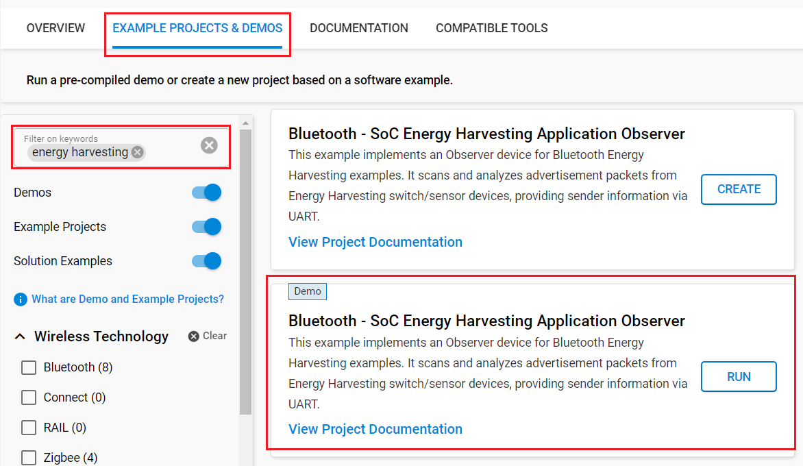

#### Testing with observer application ####

When the observer device is running, it scans for the BLE advertising data, which is sent by the *switch* device. Once the valid data is received, it will turn on/off the onboard LED accordingly, and also shows the event data on the console log. So that we can use the *switch* device to control the onboard LED of the *observer* device.

To view device log, you can just use the Console of *Simplicity Studio*:

1. Connect the observer device to the computer by using a USB cable.
2. On *Simplicity Studio* in the *Debug Adapter* window, select the device, right click on it and select *Launch Console...*.
3. On Console window select *Serial 1* tab, press enter to start monitoring device logs.

| | |
| --- | --- |
| 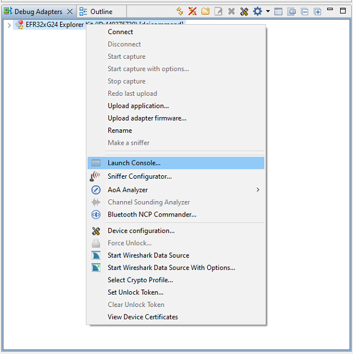 | 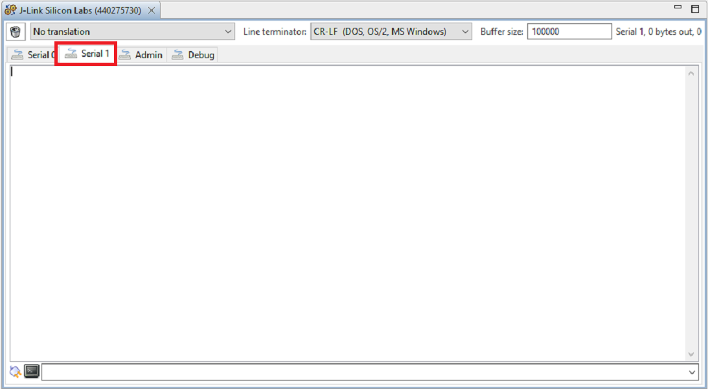 |

Below is the logs captured from *observer* device with 5 times the *switch* is pushed.

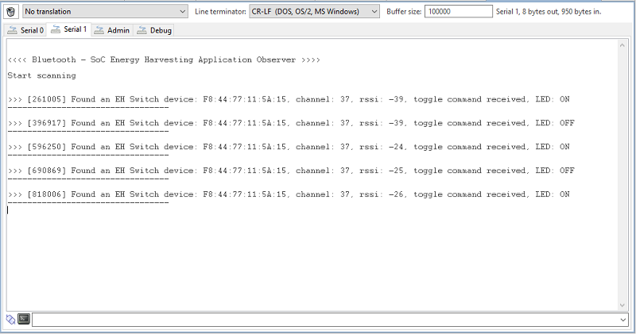

### Testing with mobile phone ###

For using mobile phone to monitor the *switch* device events, open [Simplicity Connect Mobile App](https://www.silabs.com/developer-tools/simplicity-connect-mobile-app). On the **_Scanner_** tab set up the filter with the name: *"EH Switch"*. Press the switch, it will send some advertising packets, which will be shown as a scan result on the app.

| Open filter | Setup filter | Scan result |
| --- | --- | --- |
| 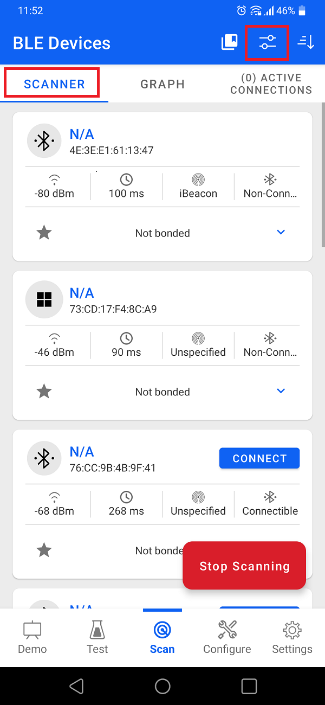 | 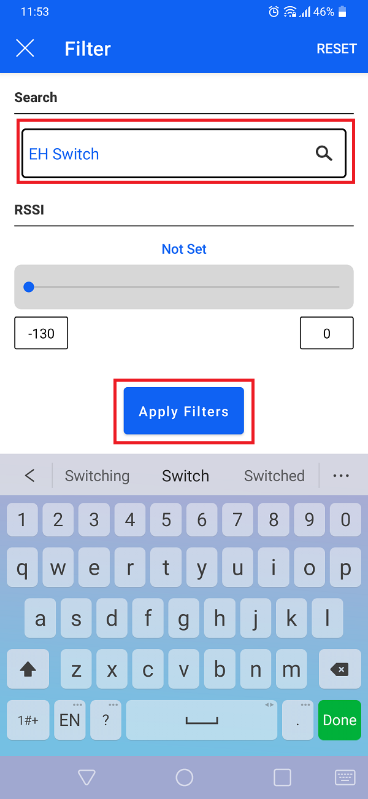 | 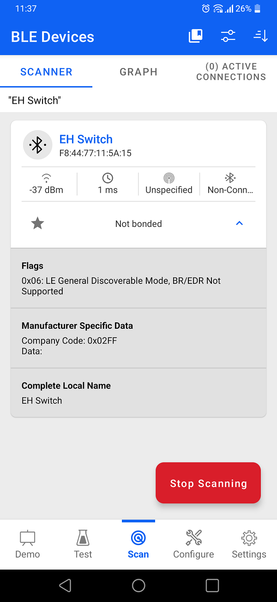

> **_NOTE:_**
For best possible reception of the packets transmitted by the switch application, please ensure the mobile phone is in **_"normal"_** power mode.

## Resources ##

- UG591: User's Guide to EFR32xG22E Energy Harvesting Explorer Kit
- [Energy Harvesting Documentation](https://www.silabs.com/development-tools/wireless/efr32xg22e-explorer-kit?tab=overview)

**Note:** Methods for measuring current consumption specific to this hardware are discussed in the kit's User's Guide (UG591). Some example measurements are also provided in the same document.

## Report Bugs & Get Support ##

To report bugs in the [Energy Harvesting Extension](https://github.com/SiliconLabs/energy_harvesting_applications) projects, you can either

- create a new "Issue" in the "Issues" section of this repo
- or report any issues you found to us via [Silicon Labs Community](https://www.silabs.com/community)

Please reference the board, project, and source files associated with the bug, and reference line numbers. If you are proposing a fix, also include information on the proposed fix. Since these examples are provided as-is, there is no guarantee that these examples will be updated to fix these issues.
