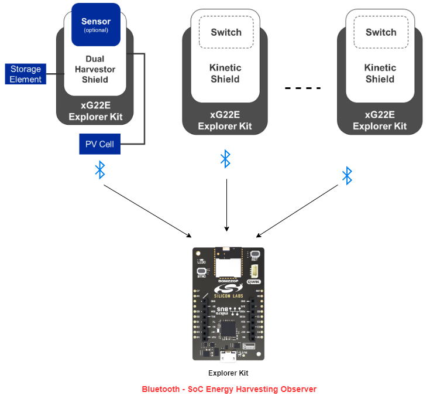
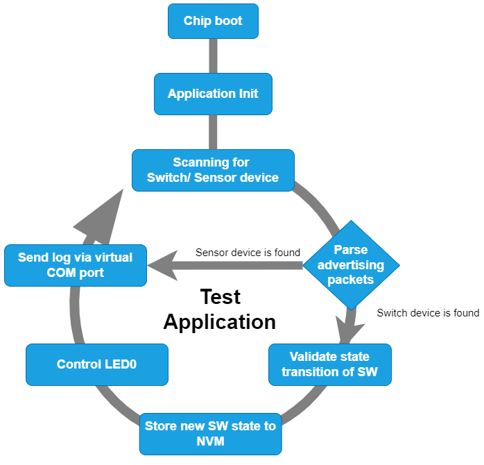
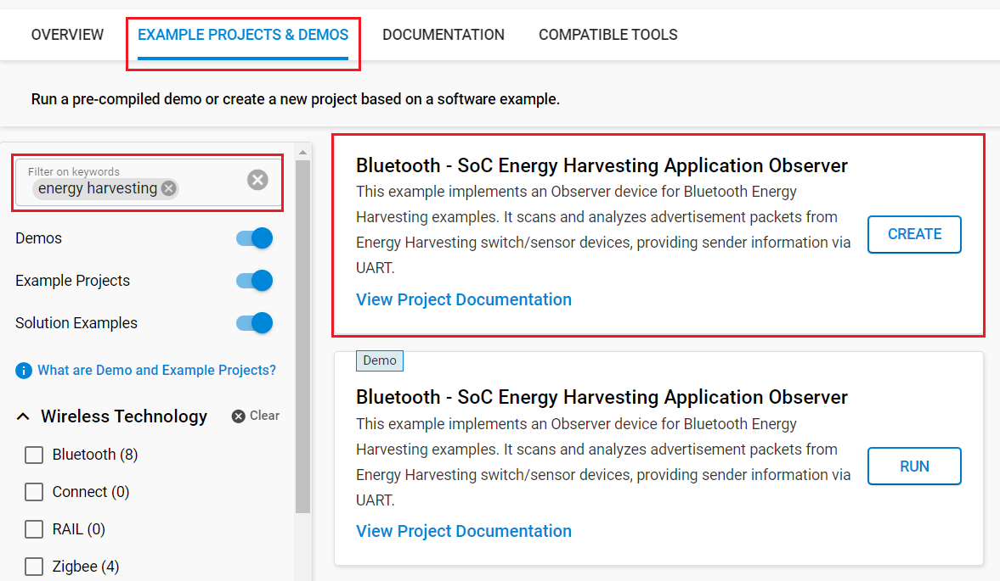
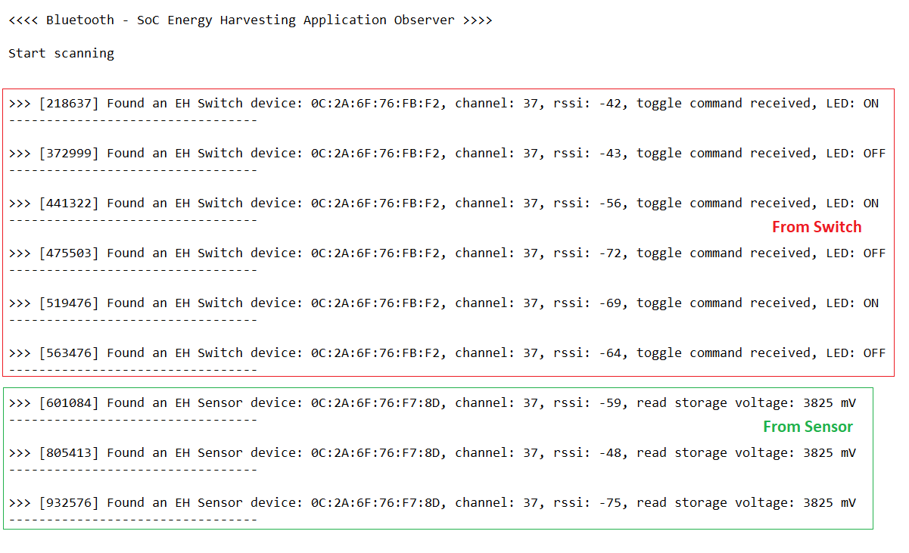

# Bluetooth - SoC Energy Harvesting Application Observer #

## Overview ##

This project aims to implement an Observer device for the Bluetooth Energy Harvesting examples. This device scans and analyzes the advertisement packet of the Energy Harvesting switch/sensor devices, providing information about the sender through a serial port. An LED provides visual feedback when connected to a switch device.

The overview of this application is shown in the image below:

## Table Of Contents ##

1. [Prerequisites](#prerequisites)
   - [Hardware requirements](#hardware-requirements)
   - [Software requirements](#software-requirements)
2. [Steps to Run Demo Application](#steps-to-run-demo-application)
   - [Create a project based on an example project](#create-a-project-based-on-an-example-project)
   - [Testing with Bluetooth Energy Harvesting examples](#testing-with-bluetooth-energy-harvesting-examples)
3. [Resources](#resources)
4. [Report Bugs & Get Support](#report-bugs--get-support)

## Prerequisites ##

### Hardware Requirements ###

- There are no specific requirements for the Observer. For simplicity, Silicon Labs recommends either the BGM220-EK4314A or xG24-EK2703A Explorer Kits

#### Hardware Connections ####

- Connect the your hardware to the PC through a compatible-cable. For example, a micro USB cable for the BGM220-EK4314A.

### Software requirements ###

- Simplicity Studio
  - Download the [Simplicity Studio v5 IDE](https://www.silabs.com/developers/simplicity-studio)
  - Follow the [Simplicity Studio User Guide](https://docs.silabs.com/simplicity-studio-5-users-guide/1.1.0/ss-5-users-guide-getting-started/install-ss-5-and-software#install-ssv5) to install Simplicity Studio IDE

- [Simplicity SDK v2024.6.2](https://github.com/SiliconLabs/simplicity_sdk/releases/tag/v2024.6.2)

- [Energy Harvesting Applications Extension](https://github.com/SiliconLabs/energy_harvesting_applications)

## Purpose/Scope ##

This project implements an Observer device for the Bluetooth Energy Harvesting examples. The main procedures are represented in the following state diagram.

  

When the Observer boots, it starts Scanning/Discovering the advertising devices to find the switch device with name "EH Switch" and the sensor device with name "EH Sensor". Once a device is found, it gets the advertising data.

- If a switch device is found, more than prompting the advertising data to the command line, the observer controls the on-board LED to simulate the state of a connected light bulb. This state is stored in non-volatile memory (NVM) as well.
Note the presence of a debounce algorithm to validate state transitions of the LED. A timer is used to prevent repeated frames from toggling the state of the light bulb. Only frames received at an interval > 1000ms will lead to state-changes.

- If a sensor device is found, the observer gets the storage voltage of the sensor device in mV and prompts it to the command line.

## Steps to Run Demo Application ##

### Create a project based on an example project ###

1. In Simplicity Studio, from the Launcher Home, add your device to My Products, click on it, and click on the **EXAMPLE PROJECTS & DEMOS** tab. Find the example project filtering by "energy harvesting".

2. Click **Create** button on the project **Bluetooth - SoC Energy Harvesting Application Observer** example. Example project creation dialog pops up -> click Create and Finish and Project should be generated.

   

3. Build and flash the example to your board.

### Testing with Bluetooth Energy Harvesting examples ###

- To test this application, you need one device running the **Bluetooth - SoC Energy Harvesting Application Observer** example, and at least one device running the **Bluetooth - SoC Energy Harvesting Sensor** or **Bluetooth RAIL - SoC Energy Harvesting Sensor** or **Bluetooth RAIL - SoC Energy Harvesting Switch** example. The topological setup for testing this example is shown in the [overview](#overview) section.

- You can launch the Console that is integrated into Simplicity Studio to receive the data from the virtual COM port of the Observer board. After selecting "Serial 1" tab, place the cursor in the command window and press "Enter" for establishing connection over serial interface between the PC and the Observer board. Once the Observer boots, it starts scanning for a sensor/ switch device. You should expect a similar output to the one below when a sensor/ switch device is found.

   

## Resources ##

- [Bluetooth - SoC Energy Harvesting Sensor](https://github.com/SiliconLabs/energy_harvesting_applications/tree/main/example/bt_soc_energy_harvesting_sensor)
- [Bluetooth RAIL - SoC Energy Harvesting Sensor](https://github.com/SiliconLabs/energy_harvesting_applications/tree/main/example/bt_rail_soc_energy_harvesting_sensor)
- [Bluetooth RAIL - SoC Energy Harvesting Switch](https://github.com/SiliconLabs/energy_harvesting_applications/tree/main/example/bt_rail_soc_energy_harvesting_kinetic_switch)

## Report Bugs & Get Support ##

To report bugs in the Application Examples projects, please create a new "Issue" in the "Issues" section of [energy_harvesting_applications](https://github.com/SiliconLabs/energy_harvesting_applications) repo. Please reference the board, project, and source files associated with the bug, and reference line numbers. If you are proposing a fix, also include information on the proposed fix. Since these examples are provided as-is, there is no guarantee that these examples will be updated to fix these issues.

Questions and comments related to these examples should be made by creating a new "Issue" in the "Issues" section of [energy_harvesting_applications](https://github.com/SiliconLabs/energy_harvesting_applications) repo.
