# Bluetooth - SoC Energy Harvesting Sensor #

## Overview ##

This example uses a Dual Harvester Shield with a lithium capacitor as storage element and a photovoltaic cell as power source. It periodically wakes up for sensor readings and advertising data then enters sleep mode for energy saving.

## Table of Contents ##

- [Overview](#overview)
- [Purpose/Scope](#purposescope)
- [Prerequisites](#prerequisites)
  - [Hardware Requirements](#hardware-requirements)
    - [Hardware Connection](#hardware-connection)
  - [Software Requirements](#software-requirements)
- [Steps to Run Demo](#steps-to-run-demo-application)
  - [Setup](#setup)
    - [Create a project based on an example project](#create-a-project-based-on-an-example-project)
  - [Test with mobile phone](#test-with-mobile-phone)
  - [Test with Bluetooth - SoC Energy Harvesting Application Observer](#test-with-bluetooth---soc-energy-harvesting-application-observer)
- [Resources](#resources)
- [Report Bugs & Get Support](#report-bugs--get-support)

## Purpose/Scope ##

The system comprises a sensor and an (at least one) observer device. The sensor device will broadcast the storage element voltage in the advertisement package in less than 1 second and then it will go into EM2 mode in 10 milliseconds then wake up to broadcast again. The sensor device will repeat that process 2 times before going into EM4 mode for 25 seconds. The observer device will scan for the sensor device and get the storage element voltage value from the advertisement data then display it on the log console or the [Simplicity Connect Mobile Application](https://apps.apple.com/us/app/simplicity-connect/id1030932759).

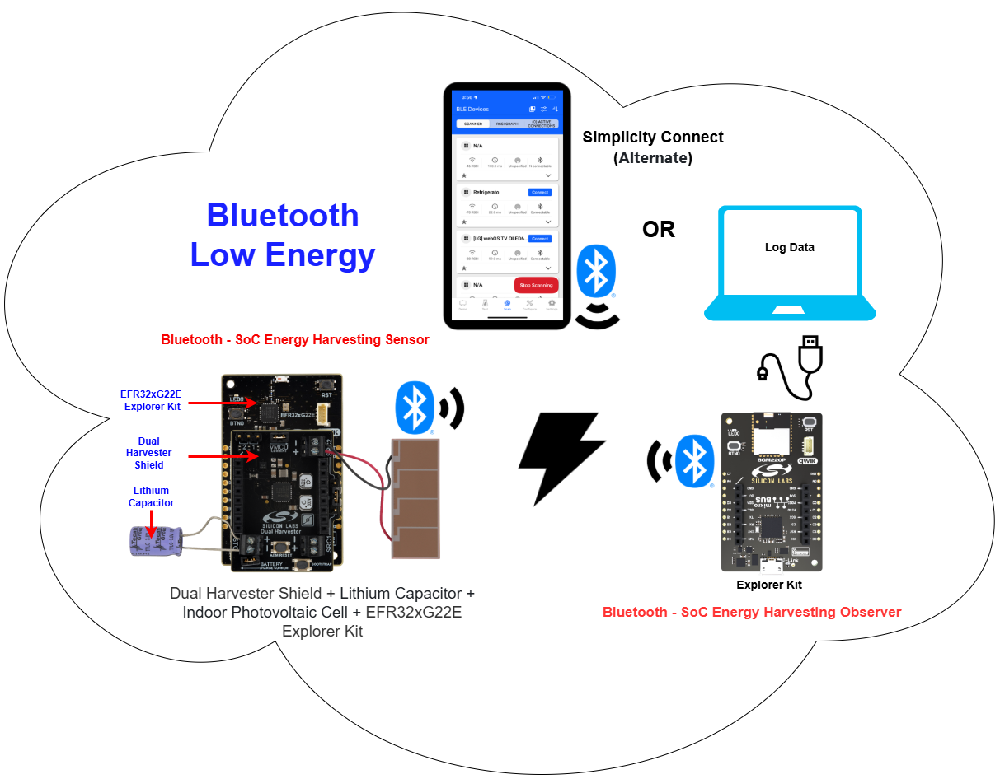

The energy-harvesting application shall be optimized to transmit only the minimal required information within the shortest feasible time slot. These types of sleepy energy-harvesting devices spend most of their lifetime in deep sleep EM4.

After a power-on reset the application reads the storage element voltage from the AEM13920 PMIC and starts to transmit it. Once the first advertisement is done, the application logic sends the microcontroller into EM2 sleep mode for 10 milliseconds and repeats this transmit cycle twice. The device goes into EM4 deep sleep mode right after transmitting the third message and stays in it until the BURTC (after 25 seconds) triggers the microcontroller to wake up.

The microcontroller wakes up and after the initialization process, it begins to read the storage element voltage and starts to transmit the messages. The payload size, TX power and the advertisement time significantly influence the required energy to transmit the data successfully. Users can reconfigure these parameters depending on the specific situation. The operation state of the sensor device is shown in the image below:

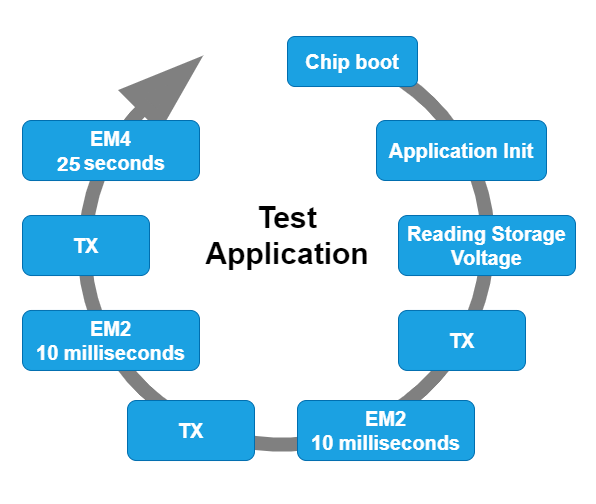

> **_NOTE_:**
The default advertisement time is 32 ms, decreasing this value can help to optimize the application to meet the available energy budget.

In your implementation, you can vary the level and duration of sleep, and modify payload size and number of transmissions based on available energy or known energy budget. More information about Bluetooth energy optimization is available [here](https://www.silabs.com/documents/public/application-notes/an1366-bluetooth-use-case-based-low-power-optimization.pdf).

**Bluetooth Stack Initialization:**

The device is configured as:

- Non-connectable mode. It sends [manufacturer specific advertisement](https://github.com/SiliconLabs/bluetooth_stack_features/tree/master/advertising/advertising_manufacturer_specific_data) packets.
- TX power is configured to 0 dBm
- Advertisement duration is configured to 32 ms

**Advertisement Packet:**

The AdvData field in the advertisement packet is as table below:

| DeviceName | Storage Element Voltage     |
|------------|---------------------|
| EH Sensor    | 2 bytes (uint16_t value - Big endian)|

- The Storage Element Voltage is in the (mV) unit. Its value is in big-endian format. It means that if the HEX value is 0x0BA5 and the DEC value is equal to:
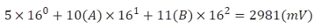

- The device is not connectable.

## Prerequisites ##

### Hardware Requirements ###

The hardware needed for this example is all included in the xG22-EK8200A, EFR32xG22E Energy Harvesting Explorer Kit. In particular, the following items are used:

- [BRD2710A, EFR32xG22E Explorer Kit Board](https://www.silabs.com/development-tools/wireless/efr32xg22e-explorer-kit?tab=overview)
- BRD8201A, Dual Harvester Shield
- TPLC-3R8/10MR8X1, Lithium Capacitor
- AM-1417CA-DGK-E, Indoor Photovoltaic cell

#### Hardware Connection ####

The Silicon Labs - Dual Harvester Shield (BRD8201A) is connected on top of the MikroBus header of the EFR32xG22E Explorer Kit (BRD2710A). Make sure that the 45-degree corner of the Silicon Labs - Dual Harvester Shield matches the 45-degree white line of the EFR32xG22E Explorer Kit. In this example, we use a Photovoltaic cell (AM-1417CA-DGK-E) as the power source element and a Lithium Capacitor (TPLC-3R8/10MR8X1) as the storage element. The hardware connection is shown in the image below. For correct assembly of the hardware, please refer to the UG591 document section 4.1 for a description of the sequence required when assembling the setup.

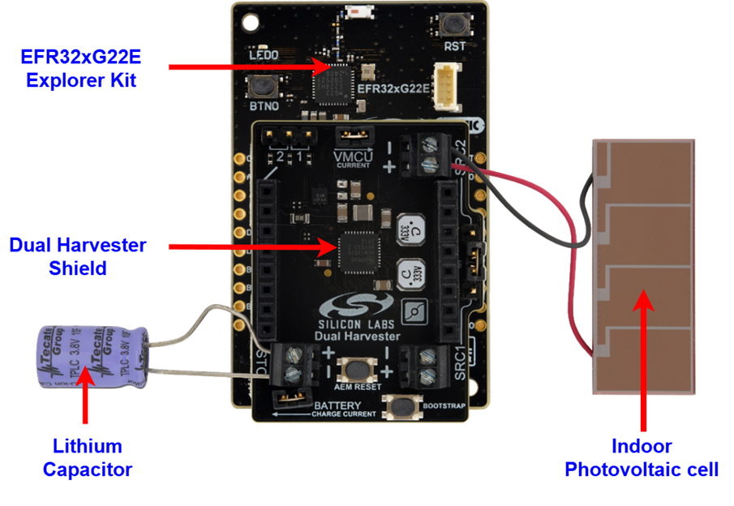

### Software Requirements ###

- Simplicity Studio
  - Download the [Simplicity Studio v5 IDE](https://www.silabs.com/developers/simplicity-studio)
  - Follow the [Simplicity Studio User Guide](https://docs.silabs.com/simplicity-studio-5-users-guide/1.1.0/ss-5-users-guide-getting-started/install-ss-5-and-software#install-ssv5) to install Simplicity Studio IDE
- [Simplicity SDK Version 2024.6.2](https://github.com/SiliconLabs/simplicity_sdk/releases/tag/v2024.6.2)
- [Energy Harvesting Applications Extension](https://github.com/SiliconLabs/energy_harvesting_applications), follow the [How to add to Simplicity Studio IDE](https://github.com/SiliconLabs/energy_harvesting_applications/README.md#how-to-add-to-simplicity-studio-ide) to install the extension.
- Simplicity Connect Mobile Application [(iOS)](https://apps.apple.com/us/app/simplicity-connect/id1030932759) or [(Android)](https://play.google.com/store/apps/details?id=com.siliconlabs.bledemo&hl=en_NZ)

## Steps to Run Demo Application ##

### Setup ###

#### Create a project based on an example project ####

To test this application, you can create a project in Simplicity Studio by selecting the example project **Bluetooth - SoC Energy Harvesting Sensor**

1. In Simplicity Studio from the Launcher Home, add your hardware to My Products, click on it, and click on the **EXAMPLE PROJECTS & DEMOS** tab. Find the example project filtering by "energy harvesting".

2. Click **Create** button on the project **Bluetooth - SoC Energy Harvesting Sensor** example for sensor device. Example project creation dialog pops up -> click Create and Finish and Project should be generated.

    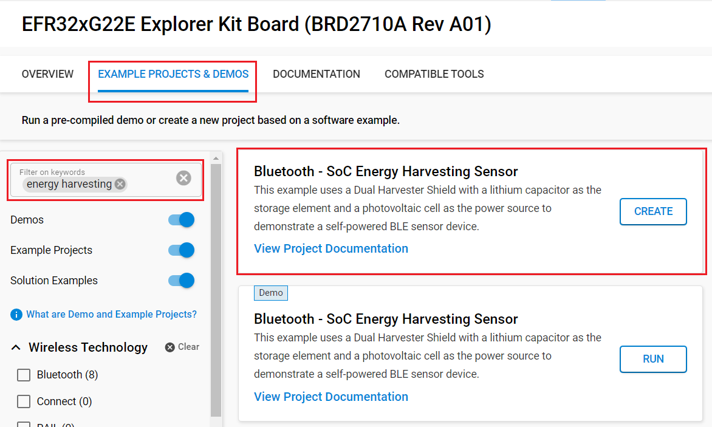

3. Build and flash the examples to the board.

#### Interacting with the AEM13920 ####

The Energy Harvesting SDK provides a set of APIs for interacting with the PMIC. These APIs are built using proprietary libraries from e-peas. During operation, the device reads battery voltage from AEM13920 IC via I2C protocol and updates the payload data with the extracted data. The PMIC is configured in Hardware by a series of resistors connected to input pins to work with the components provided for this example. However, the xG22 SoC can overwrite the default settings by accessing the configuration registers by I2C. To do that, users need to:

1. Change the macro "USER_OVERRIDE_AEM13920_CONFIG" to "1" in line 42 file "app.c". Its default value is "0". See the example in the below image:

    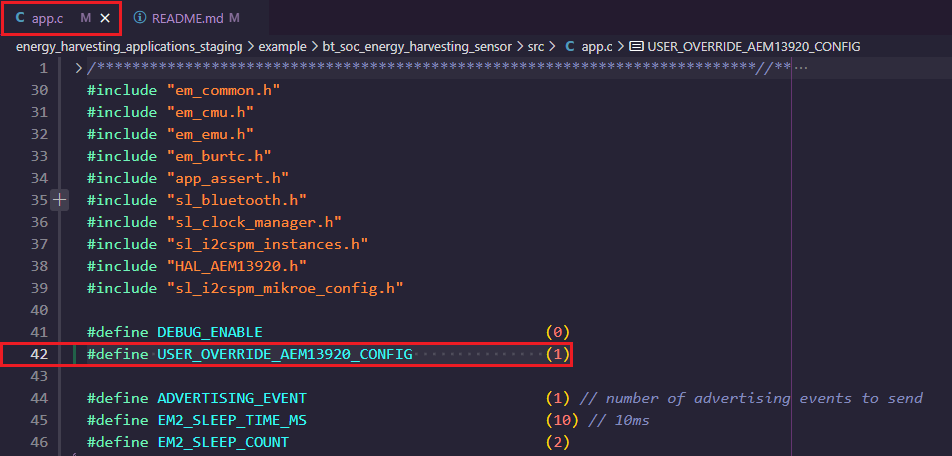

2. Modify the macros for the AEM13920 configuration defined in the app.c file:

    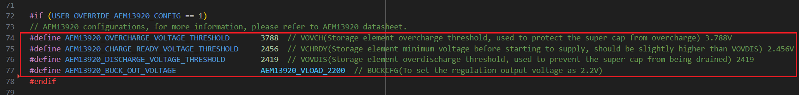

3. Users exploring other energy sources and/or storage elements may need to add/remove some APIs in the "initAEM13920" function. Users are strongly encouraged to consult [the online software documentation on the e-peas’ website](https://doc.e-peas.com/aem13920/software/index.html) and download [the AEM13920 datasheet](https://e-peas.com/aem13920_datasheet/).

    > **_NOTE_:** The "AEM13920_LoadConfiguration" function loads all bit fields in the I2C registers. Fields that have not been overwritten by I2C maintain their factory default values, and the PMIC will ignore the hardware configuration of its input pins. Please make sure all parameters relative to your specific application (non-default) are set by calling the proper functions, as described in the software documentation.

    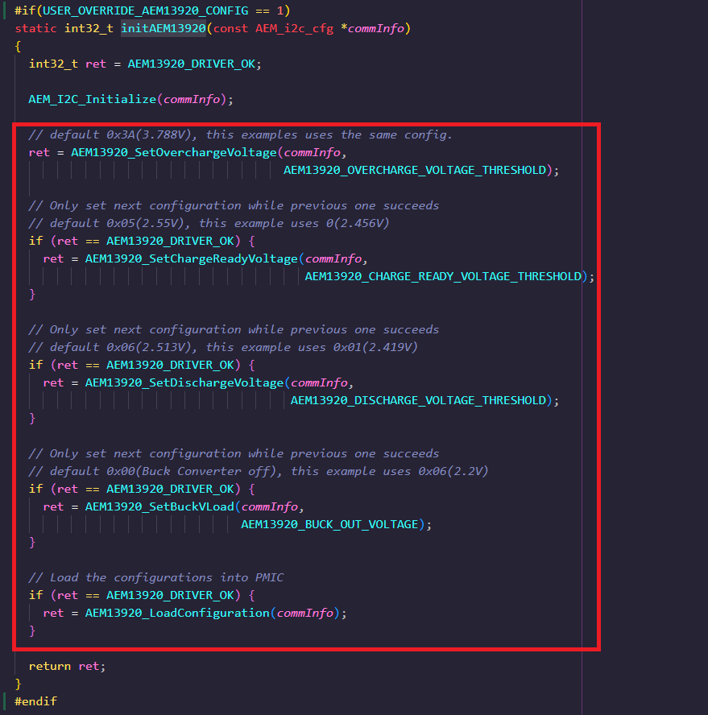

### Test with mobile phone ###

You can use a smartphone application such as the [Simplicity Connect](#software-requirements), to see the advertising packet from the Sensor device.

- Open the Simplicity Connect Mobile Application.

- Open the Bluetooth Browser.

- Find the device advertising as **EH Sensor**.

  | Open filter               | Setup filter                      | Scan result          |
  | :---------------------: | :-------------------------: | :---------------------: |
  | 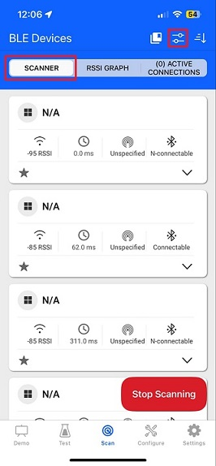 | 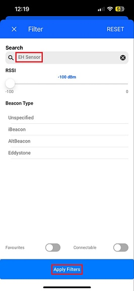 | 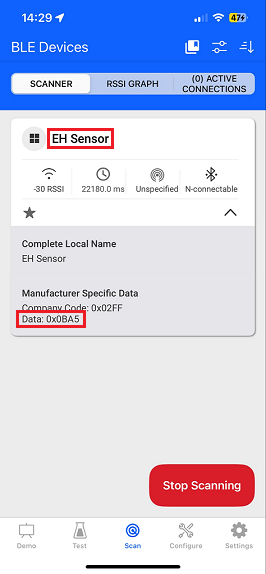 |

> **_NOTE_:**
For the best possible BLE reception, ensure the power setting of the mobile phone is in "normal" energy mode not in "energy saving" mode.

### Test with Bluetooth - SoC Energy Harvesting Application Observer ###

There is one more option, users can use one EFR32/BGM device running the **Bluetooth - SoC Energy Harvesting Application Observer** example to scan the sensor devices and view data with the log console. The result is shown in the image below:

  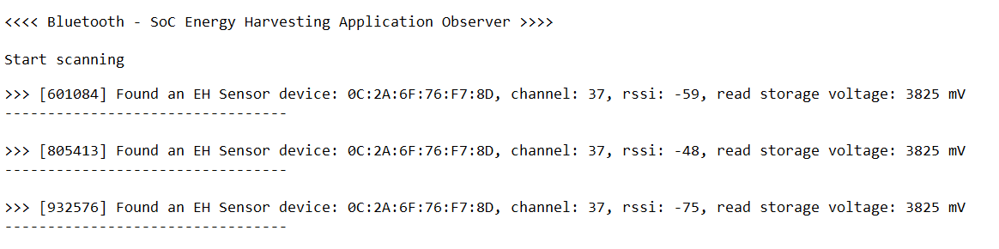

## Resources ##

- UG591: User's Guide to EFR32xG22E Energy Harvesting Explorer Kit
- [Energy Harvesting Documentation](https://www.silabs.com/development-tools/wireless/efr32xg22e-explorer-kit?tab=overview)

> **_NOTE_:** Methods for measuring current consumption specific to this hardware are discussed in the kit's User's Guide (UG591). Some example measurements are also provided in the same document.

## Report Bugs & Get Support ##

To report bugs in the [Energy Harvesting Extension](https://github.com/SiliconLabs/energy_harvesting_applications) projects, you can either

- create a new "Issue" in the "Issues" section of this repo
- or report any issues you found to us via [Silicon Labs Community](https://www.silabs.com/community)

Please reference the board, project, and source files associated with the bug, and reference line numbers. If you are proposing a fix, also include information on the proposed fix. Since these examples are provided as-is, there is no guarantee that these examples will be updated to fix these issues.
