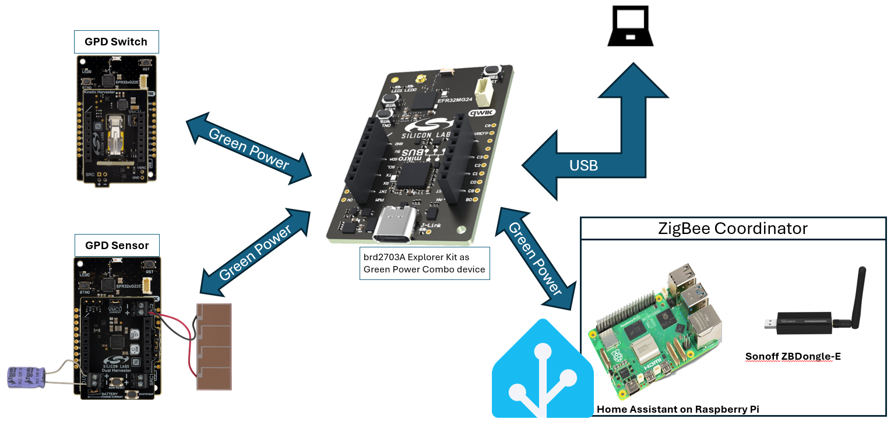
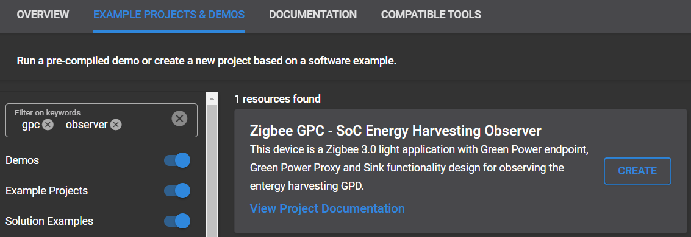
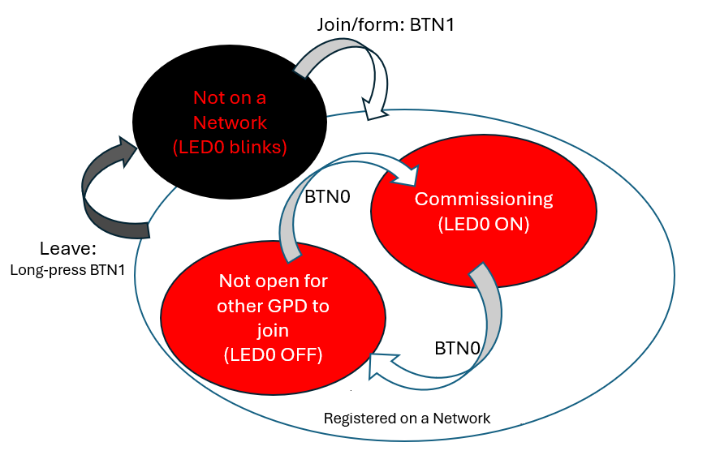

# Zigbee GPC - SoC Energy Harvesting Observer #

## Overview ##

This project demonstrates a ZigBee Green Power Combo(GPC) device acting as an observer for Energy Harvesting Green Power Devices(GPD). Multiple GPDs are allowed to pair with the GPC. The GPC can receive and process Green Power Frames (GPDFs) and convert GPDFs to ZigBee Cluster Library(ZCL) packets. Its network abilities match the requirement of ZigBee specification which can either form a distributed ZigBee network or join an existing network, e.g. network formed by a Home Assistant coordinator on a Raspberry Pi.

## Table of Contents ##

- [Overview](#overview)
- [Purpose/Scope](#purposescope)
  - [How it Works](#how-it-works)
- [Prerequisites](#prerequisites)
  - [Hardware Requirements](#hardware-requirements)
  - [Software Requirements](#software-requirements)
- [Steps to Run Demo Application](#steps-to-run-demo-application)
  - [Setup](#setup)
    - [Create a project based on an example project](#create-a-project-based-on-an-example-project)
  - [Testing](#testing)
- [Resources](#resources)
- [Report Bugs & Get Support](#report-bugs--get-support)

## Purpose/Scope ##

Based on Z3 Light project, this application demonstrates the functionality of a Green Power combo device that has proxy and sink instances integrated in one application. The GPC interacts with GPDs, which are typically energy-harvesting, battery-less or ultra-long battery life devices such as switches and sensors. The GPC acts as a bridge between the ultra-low power GPDs and the standard Zigbee network. It translates GPDFs into standard Zigbee Cluster Library (ZCL) frames for the rest of the network to understand.

The communication between GPC and GPDs is initiated by the ZigBee Green Power **Commissioning** process. The GPC participates in the commissioning process of new GPDs, helping to securely integrate them into the ZigBee network. The GPDs use a compact message format called Green Power Device Frames (GPDF) to minimize energy consumption during transmission. The GPC receives these GPDFs and processes them. Secure communication with GPDs is supported, including encryption and message integrity checks.

The ZigBee GPC includes a software de-bouncing feature to prevent rapid LED toggling. When the GPC receives a toggle command from the GPD, it toggles the LED and starts a 1-second timer. Any additional toggle commands received before the timer expires are ignored.

In the example [Zigbee GPD - SoC Energy Harvesting Sensor](https://github.com/SiliconLabs/energy_harvesting_applications/tree/main/example/zigbee_gpd_soc_energy_harvesting_sensor/), the GPD sensor reads the current energy storage voltage from the Power Management IC(PMIC) and reports it to the GPC. The GPC observer prints the received data and also the calculated voltage value through serial port.

In the example [Zigbee GPD - SoC Energy Harvesting Switch](https://github.com/SiliconLabs/energy_harvesting_applications/tree/main/example/zigbee_gpd_soc_energy_harvesting_switch/), the GPD switch sends toggling command when the kinetic switch is pushed. While receiving the GPDF, the GPC observer reacts by toggling its LED1.

### How It Works ###

This application creates a Green Power endpoint on endpoint 242 with device ID 0x66 which indicates Green Power Combo Minimum device. According to Green Power specification, the reserved Green Power End Point shall use ProfileID 0xA1E0 in the Simple Descriptor, as well as in all GreenPower cluster messages. In addition, it shall support Green Power cluster 0x0021.

The GPC supports virtual com port feature which can be used to output the messages for debugging. The convenient ZigBee CLI commands are also supported. Users can manage network formation and GP commissioning using either the CLI or the on-board buttons, depending on whether the vcom is enabled or disabled.

## Prerequisites ##

### Hardware Requirements ###

- [xG24-EK2703A](https://www.silabs.com/development-tools/wireless/efr32xg24-explorer-kit?tab=overview) EFR32xG24 Explorer Kit
  - 1x BRD2703A Explorer Kit Board

#### Hardware Connection ####

To set up the device, plug one end of the USB Type-C cable into the device's USB Type-C port and connect the other end to an available USB port on your PC.
The device will power on automatically once connected. Your PC should recognize the device.

### Software Requirements ###

- Simplicity Studio
  - Download the [Simplicity Studio v5 IDE](https://www.silabs.com/developers/simplicity-studio)
  - Follow the [Simplicity Studio User Guide](https://docs.silabs.com/simplicity-studio-5-users-guide/1.1.0/ss-5-users-guide-getting-started/install-ss-5-and-software#install-ssv5) to install Simplicity Studio IDE
- [Simplicity SDK Version 2024.6.2](https://github.com/SiliconLabs/simplicity_sdk/releases/tag/v2024.6.2)
- [Energy Harvesting Applications Extension](https://github.com/SiliconLabs/energy_harvesting_applications), follow the [How to add to Simplicity Studio IDE](https://github.com/SiliconLabs/energy_harvesting_applications/blob/main/README.md#how-to-add-to-simplicity-studio-ide) to install the extension.

## Steps to Run Demo Application ##

### Setup ###

Please create a project in Simplicity Studio based on an example project to test this application

#### Create a project based on an example project ####

1. In Simplicity Studio from the Launcher Home, add BRD2703A to My Products, click on it, and click on the EXAMPLE PROJECTS & DEMOS tab. Find the example project with the filter "GPC" and "observer".

2. Click Create button on the Zigbee GPC - SoC Energy Harvesting Observer example. Example project creation dialog pops up -> click Create and Finish and Project should be generated.

   

3. In order to implement the de-bouncing feature, some minor modifications in the SDK are required. The changes have been included in this example, so no additional modifitions are needed manually. To view the changes, search for the macro **DEBOUNCE_INTERVAL_MS** in "SDK"/protocol/zigbee/app/framework/plugin/on-off/on-off.c. The de-bouncing is enabled when DEBOUNCE_INTERVAL_MS is greater than 0.

4. Build and flash the examples to the board.

**Note:**

- The bootloader is not required for this example.

### Testing ###
The following diagram summarizes the machine states of the GPC observer from a high level perspective and can be useful to refer while reading further in this section. 
 
**Network Steering and Formation:**
If the GPC's network is not up, i.e. it has not formed its own distributed network or joined an existing network, LED0 keeps blinking slowly. In this state, pressing BTN1 will initiate network steering. The GPC will scan different channels to detect Zigbee networks in its range and eventully attempt to join the discovered network. If not joining to a network afterwards, the GPC forms a distributed network instead. The CLI command **plugin network-steering start 0** can also initiate network steering. Note that after the button is pressed or the CLI command sent, LED0 keeps blinking until the Network Steering process ends.

**Commissioning:**
Once the network is ready, LED0 stops blinking. In this state, pressing BTN0 toggles commissioning mode on or off. When commissioning mode is enabled, LED0 remains solidly lit. When commissioning mode is exited, LED0 turns off. Commissioning is eventually initiated by a GPD. Please refer to the GPD example projects for detailed steps of how to pair the GPD with GPC.

**Network Leave:**
If the network is up, either issuing the CLI "network leave" or long-pressing BTN1 will cause the GPC to leave the network. After holding BTN1 for 2 seconds or longer, LED0 starts quickly blinking. The GPC will leave the network and perform software reboot after BTN1 is released.

**Manage paired GPDs:**
To check the state of paired GPD, use the CLI "plugin green-power-client print-proxy-table".
To unpair the paired GPDs, issue the CLI "plugin green-power-client clear-proxy-table".

## Resources ##

- [Zigbee GPD - SoC Energy Harvesting Sensor](https://github.com/SiliconLabs/energy_harvesting_applications/tree/main/example/zigbee_gpd_soc_energy_harvesting_sensor)
- [Zigbee GPD - SoC Energy Harvesting Switch](https://github.com/SiliconLabs/energy_harvesting_applications/tree/main/example/zigbee_gpd_soc_energy_harvesting_switch/)

- [UG103.15](https://www.silabs.com/documents/public/user-guides/ug103-15-green-power-fundamentals.pdf) Green Power Fundamentals
- [UG392](https://www.silabs.com/documents/public/user-guides/ug392-using-sl-green-power-with-ezp.pdf) Using Silicon Labs Green Power with Zigbee EmberZNet PRO
- [UG591](https://www.silabs.com/documents/public/user-guides/ug591-ek8200a-user-guide.pdf) User's Guide to EFR32xG22E Energy Harvesting Explorer Kit
- [Energy Harvesting Documentation](https://www.silabs.com/development-tools/wireless/efr32xg22e-explorer-kit?tab=overview)

## Report Bugs & Get Support ##

You are always encouraged and welcome to report any issues you found to us via [Silicon Labs Community](https://www.silabs.com/community)
