# Zigbee GPD - SoC Energy Harvesting Sensor #

## Overview ##
This project showcases a ZigBee Green Power device that operates without a battery, powered entirely by energy harvested from a photovoltaic (PV) cell. The device periodically wakes up to send reports to a paired Green Power Combo device, demonstrating an energy-efficient and sustainable communication system.

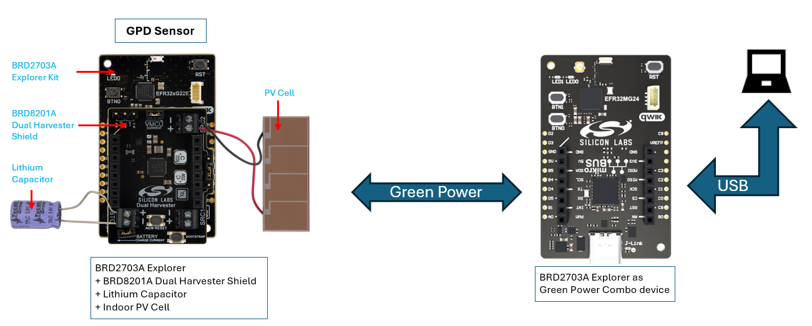

## Table of Contents ##

- [Overview](#overview)
- [Purpose/Scope](#purposescope)
  - [How it Works](#how-it-works)
- [Prerequisites](#prerequisites)
  - [Hardware Requirements](#hardware-requirements)
    - [Hardware Connection](#hardware-connection)
  - [Software Requirements](#software-requirements)
- [Steps to Run Demo Application](#steps-to-run-demo-application)
  - [Setup](#setup)
    - [Create a project based on an example project](#create-a-project-based-on-an-example-project)
    - [Interacting with the AEM13920](#interacting-with-the-aem13920)
    - [For GPC create a Zigbee GPC Observer project](#for-gpc-create-a-zigbee-gpc-observer-project)
  - [Testing](#testing)
    - [Test with Silabs GPC distributed network](#test-with-silabs-gpc-distributed-network)
    - [Test with Home Assistant on Raspberry Pi and Sonoff ZBDongle](#test-with-home-assistant-on-raspberry-pi-and-sonoff-zbdongle)
- [Resources](#resources)
- [Report Bugs & Get Support](#report-bugs--get-support)

## Purpose/Scope ##

This example utilizes Silicon Labs' latest system-on-chip (SoC) solution, the EFR32MG22E. The SoC functions as a Green Power Device (GPD) and completes a commissioning process with a Green Power Combo (GPC) device. After commissioning, the GPD enters EM4 shut-off mode, the SoC's lowest energy consumption state. At preconfigured intervals, the GPD wakes up, reads the current energy storage voltage from the Power Management IC (PMIC), and reports this data to the GPC, showcasing an energy-efficient and sustainable operation.

- Green Power Combo device example project is available on GitHub - [Zigbee GPC - SoC Energy Harvesting Observer](https://github.com/SiliconLabs/energy_harvesting_applications/tree/main/example/zigbee_gpc_soc_energy_harvesting_observer)

### How It Works ###

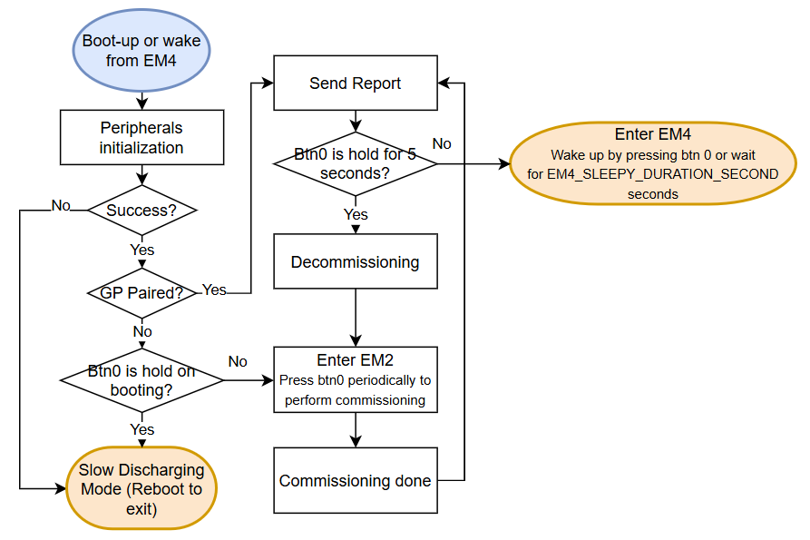

The application firmware operates as illustrated in the diagram above. Unlike standard ZigBee devices, the Green Power Device (GPD) does not maintain a constant ZigBee connection with its parent device. Instead, it enters EM4 shut-off mode which is the lowest energy consumption mode most of the time after commissioning. This behavior is central to the energy-harvesting design of this example. While in EM4, most peripherals are powered down, and they must be re-initialized upon waking.

Before commissioning, the device demonstrates another energy mode, EM2. In EM2, the energy consumption is slightly higher than EM4, but most peripherals remain active, supporting the commissioning process and other operations.

For testing purposes, if the device is not paired and Button 0 is held during boot / after reset, it enters Slow Discharging Mode, in which it continuously sends packets. This mode facilitates testing and evaluation of the device's performance.

## Prerequisites ##

### Hardware Requirements ###

- xG22-EK8200A EFR32xG22E Energy Harvesting Explorer Kit
  - 1x [BRD2710A](https://www.silabs.com/development-tools/wireless/efr32xg22e-explorer-kit?tab=overview) - EFR32xG22E Explorer Board 
  - 1x BRD8201A - Dual-source Energy Harvester Shield, with e-peas PMIC [AEM13920](https://e-peas.com/product/aem13920-dual-source-energy-harvesting/)
  - 1x [AM-1417CA-DGK-E](https://www.digikey.fi/en/products/detail/panasonic-bsg/AM-1417CA-DGK-E/2165185?srsltid=AfmBOorLxw9j8zAgh_TfQ08n8cPcNWbRo8Y4Q2tpDqP7lzBZQPNEgTyW) photovoltaic cell for indoor use
  - 1x [TPLC-3R8/10MR8X14](https://www.digikey.tw/en/products/detail/tecate-group/TPLC-3R8-10MR8X14/12417602) lithium capacitor

- [xG24-EK2703A](https://www.silabs.com/development-tools/wireless/efr32xg24-explorer-kit?tab=overview) EFR32xG24 Explorer Kit
  - 1x BRD2703A Explorer Kit Board

#### Hardware Connection ####

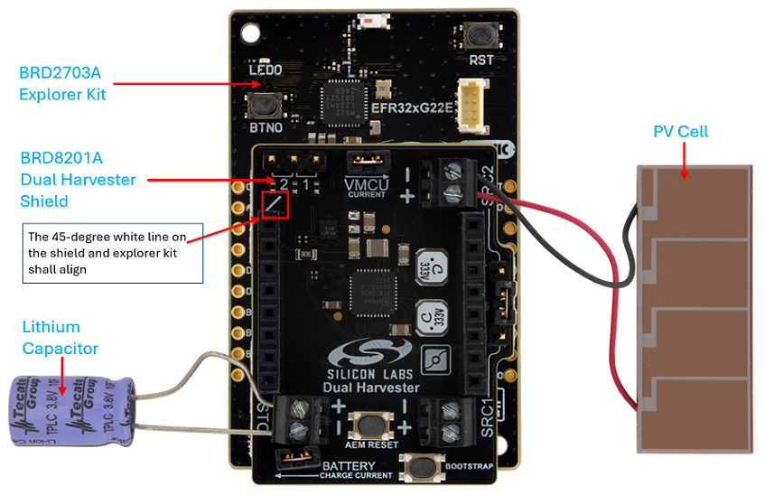

1. Connect BRD2710A and BRD8201A together as the picture above.

2. Connect the super cap to STO. **It is important to pay attention to polarity and not to shorten the capacitor leads.**

3. Connect the PV cell to SRC2. Pay attention to polarity as well.

   **_NOTE_:** SRC1 and/or other energy harvesting sources can also be used. For more information, please refer to [UG591: EFR32xG22E Energy Harvesting Explorer Kit](https://www.silabs.com/documents/public/user-guides/ug591-ek8200a-user-guide.pdf).

### Software Requirements ###

- Simplicity Studio
  - Download the [Simplicity Studio v5 IDE](https://www.silabs.com/developers/simplicity-studio)
  - Follow the [Simplicity Studio User Guide](https://docs.silabs.com/simplicity-studio-5-users-guide/1.1.0/ss-5-users-guide-getting-started/install-ss-5-and-software#install-ssv5) to install Simplicity Studio IDE
- [Simplicity SDK Version 2024.6.2](https://github.com/SiliconLabs/simplicity_sdk/releases/tag/v2024.6.2)
- [Energy Harvesting Applications Extension](https://github.com/SiliconLabs/energy_harvesting_applications), follow the [How to add to Simplicity Studio IDE](https://github.com/SiliconLabs/energy_harvesting_applications/README.md#how-to-add-to-simplicity-studio-ide) to install the extension.

- Install Energy Harvesting SDK Extension, with the "AEM13920 - Dual sources energy manager - I2C" component.
  **Note:** The quality of this component is EVALUATION, so it's not visible by default. Change the quality filter by checking the checkbox for the evaluation components in the quality filter view to see AEM13920 component listed.

  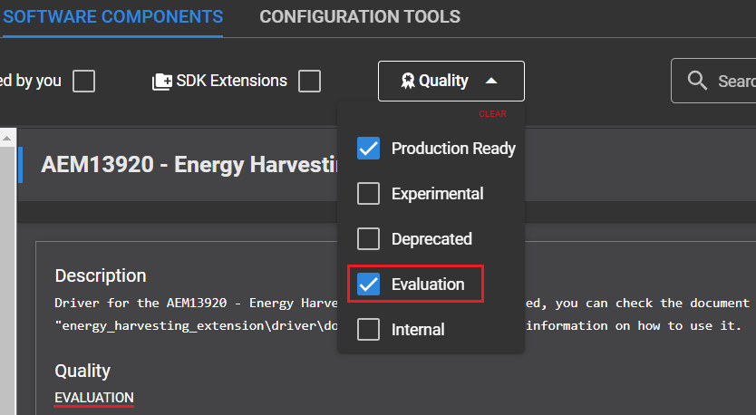


## Steps to Run Demo Application ##

### Setup ###

Please create a project in Simplicity Studio based on an example project to test this application

#### Create a project based on an example project ####

1. In Simplicity Studio from the Launcer Home, add BRD2710A to My Products, click on it, and click on the EXAMPLE PROJECTS & DEMOS tab. Find the example project with the filter "GPD" and "Sensor".

2. Click Create button on the Zigbee GPD - SoC Energy Harvesting Sensor example. Example project creation dialog pops up -> click Create and Finish and Project should be generated.

   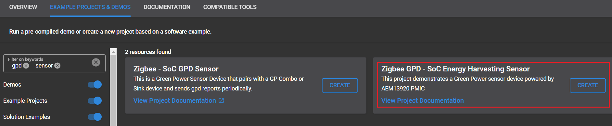

3. Make sure the i2c configuration(I2CSPM) is correct - SCL: PD02; SDA: PD03.

4. Check the software component "Green Power Device Application Support" which manages most configurations of a GPD.

   No modifications are required to pair this GPD example application with the GPC. However, if you plan to pair multiple GPDs with a single GPC simultaneously, ensure that each GPD has a unique Source ID and IEEE address to avoid conflicts.

   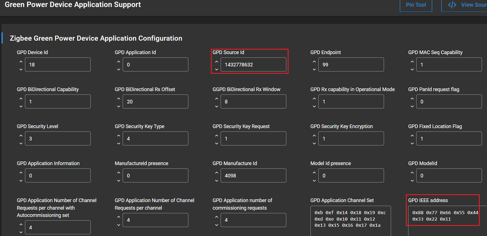

5. Build and flash the examples to the board.

#### Interacting with the AEM13920 ####

The Energy Harvesting SDK provides a set of APIs for interacting with the PMIC. These APIs are built using proprietary libraries from e-peas. During operation, the device reads battery voltage from AEM13920 IC via I2C protocol and updates the payload data with the extracted data. The PMIC can be configured in two ways: hardware configuration, using a series of resistors connected to input pins, or software configuration, by modifying the configuration registers via I²C. When configured via I²C, the software settings override the hardware configuration. This example demonstrates the I²C-based configuration approach, with settings that are perfectly matched to the combination BRD2710A and BRD8201A.

The function **initAEM13920** sets the I²C instance, initializes AEM13920 handler, and overrides the PMIC configurations. The default configurations are read using API **AEM13920_GetConfiguration** and put into the variable **aem_cfg**. Then, some of the fields are modified to match the design of xG22-EK8200A EFR32xG22E Energy Harvesting Explorer Kit.

```c
static int32_t initAEM13920(AEM13920_Handler_t *aem_handler,
                            AEM_i2c_cfg *commInfo)
{
  int32_t ret = AEM13920_DRIVER_OK;
  AEM13920_CONFIG_t aem_cfg;
  aem_handler->i2c_cfg = commInfo;

  ret = AEM13920_Initialize(aem_handler);

  if (ret == AEM13920_DRIVER_OK) {
    ret = AEM13920_GetConfiguration(aem_handler, &aem_cfg);
  }

  if (ret == AEM13920_DRIVER_OK) {
    aem_cfg.src1_regu_mode = AEM13920_SRCREGU_CONST;
    aem_cfg.src1_const_voltage = 600;
    aem_cfg.src1_boost_tmult = AEM13920_TMULT3;
    aem_cfg.src1_boost_enable = true;
    aem_cfg.src1_boost_high_power_enable = true;
    aem_cfg.src1_low_thresh = AEM13920_SRCLOW_THRESH_112;

    aem_cfg.src2_regu_mode = AEM13920_SRCREGU_MPPT;
    aem_cfg.src2_mppt_ratio = AEM13920_MPPT_RATIO_75;
    aem_cfg.src2_mppt_duration = AEM13920_MPPT_DUR8;
    aem_cfg.src2_mppt_period = AEM13920_MPPT_PER512;
    aem_cfg.src2_boost_tmult = AEM13920_TMULT3;
    aem_cfg.src2_boost_enable = true;
    aem_cfg.src2_boost_high_power_enable = true;
    aem_cfg.src2_low_thresh = AEM13920_SRCLOW_THRESH_112;

    aem_cfg.vovdis = 2500;
    aem_cfg.vchrdy = 2550;
    aem_cfg.vovch = 3800;

    aem_cfg.buck_vout = AEM13920_VOUT_2200;
    aem_cfg.buck_tmult = AEM13920_TMULT4;

    aem_cfg.temp_mon_enable = true;
    aem_cfg.temp_rdiv = 22000000;
    aem_cfg.temp_cold_ch_rth = 98180087;
    aem_cfg.temp_hot_ch_rth = 2261276;
    aem_cfg.temp_cold_dis_rth = 98180087;
    aem_cfg.temp_hot_dis_rth = 2261276;

    aem_cfg.apm_src1_enable = false;
    aem_cfg.apm_src2_enable = false;
    aem_cfg.apm_buck_enable = false;
    aem_cfg.apm_mode = AEM13920_APM_MODE_POWER_METER;  // Ignored as APM is disabled
    aem_cfg.apm_window = AEM13920_APM_WINDOW_128 ;     // Ignored as APM is disabled

    aem_cfg.i2c_rdy_irq_enable = true;
    aem_cfg.apm_done_irq_enable = false;
    aem_cfg.apm_err_irq_enable = false;
    aem_cfg.src_low_irq_enable = false;
    aem_cfg.src1_mppt_start_irq_enable = false;
    aem_cfg.src1_mppt_done_irq_enable = false;
    aem_cfg.src2_mppt_start_irq_enable = false;
    aem_cfg.src2_mppt_done_irq_enable = false;
    aem_cfg.vovdis_irq_enable = false;
    aem_cfg.vchrdy_irq_enable = false;
    aem_cfg.vovch_irq_enable = false;
    aem_cfg.sto_done_irq_enable = false;
    aem_cfg.temp_ch_irq_enable = false;
    aem_cfg.temp_dis_irq_enable = false;
    aem_cfg.temp_done_irq_enable = false;

    // - Write the updated configuration to the I2C registers,
    // - Start the synchronization of the registers,
    // - Wait for it to complete
    ret = AEM13920_SetConfiguration(aem_handler, &aem_cfg, true);
  }

  return ret;
}
```

Users exploring other energy sources and/or storage elements may need to add, modify, or remove some settings in the "initAEM13920" function. Users are strongly encouraged to consult [the online software documentation on the e-peas’ website](https://doc.e-peas.com/aem13920/software/index.html) and download [the AEM13920 datasheet](https://e-peas.com/aem13920_datasheet/).

> **_NOTE_:** The "AEM13920_SetConfiguration" function loads all bit fields in the I2C registers. The PMIC will ignore the hardware configuration of its input pins. Please make sure all parameters relative to your specific application (non-default) are set accordingly, as described in the AEM13920 software documentation.

#### For GPC create a Zigbee GPC Observer project ####

Refer to [**Zigbee GPC - SoC Energy Harvesting Observer**](https://github.com/SiliconLabs/energy_harvesting_applications/tree/main/example/zigbee_gpc_soc_energy_harvesting_observer) to create a GPC observer project.

### Testing ###

After flashing the code to the target device, the application starts running automatically. If the energy harvester BRD8201A is not assembled yet, the SoC cannot complete PMIC initialization and will enter the Slow Discharging Mode in which the LED0 is turned on.

Before starting the test, connect the GPC device to a PC via USB. The device outputs debug messages through a virtual COM port (vcom), with the default serial configuration set to a baud rate of 115200, no parity, one stop bit, and no hardware flow control. Next, unplug the GPD and attach the energy harvester shield.

#### Test with Silabs GPC distributed network ####
#### Preparing the observer ####
Make sure the GPC has formed a distributed network. If LED0 is blinking, it indicates the GPC's network is not ready, check GPC observer project for more information.

#### Commissioning ####
1. Press BTN0 on the GPC end (BRD2703A) to enter commissioning state. When the GPC application is in commissioning state, LED0 remains on. If LED0 is blinking, it indicates the GPC's network is not ready, check GPC observer project for more information. 
   While entering commissioning mode, the GPC outputs the debug message below which be captured using any serial port tool.

   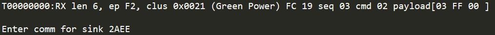

2. Pressing BTN0 on GPD **repeatedly** at 1-second intervals(precise timing is not required) until the commissioning process is done. Observe the commissioning process via the debug messages sent by GP Combo device. Typically, the process will be completed within 10 presses of the button.

   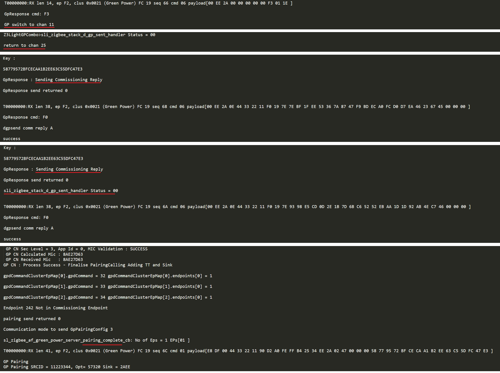

3. After the commissioning process completes, the GPD sends report after pressing BTN0 or at preconfigured interval which is controlled by the macro **EM4_SLEEPY_DURATION_SECOND** with the default value 90 seconds. The report contains the Storage Voltage of the super capacitor read from the PMIC.

   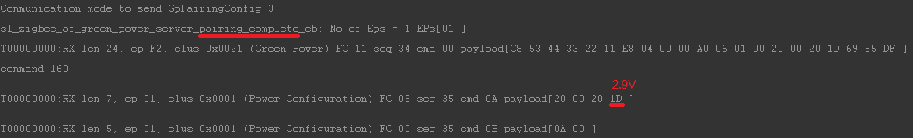

#### Decommissioning ####

To initiate decommissioning from GPD, hold BTN0 for 5 seconds. The GP Combo device will receive the packet and the debug messages below will be printed.

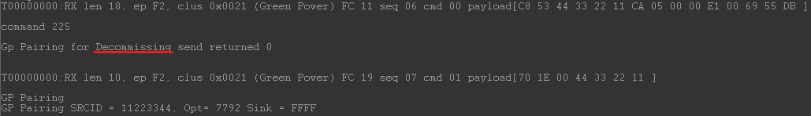

#### Slow Discharging Mode ####

While the GPD is not paired, holding BTN0 on booting(For instance, hold BTN0 and press RST button) will force the device to enter slow discharging mode in which it continuously sends packets. This mode facilitates testing and evaluation of the device's performance.

#### Test with a centralized Zigbee network ####

This example also demonstrates how to join the GBC to Home Assistant system running on Raspberry Pi with a ZigBee dongle Sonoff ZBDongle-E.
**Note:** The following steps are optional and explain how to alternatively set-up the GPC to join a centralized network instead of forming its own distributed network as in the previous section
#### Preparing the observer ####
Make sure the GPC has NOT formed a distributed network. If LED0 is blinking, you are all set. Please check GPC observer project for more information.


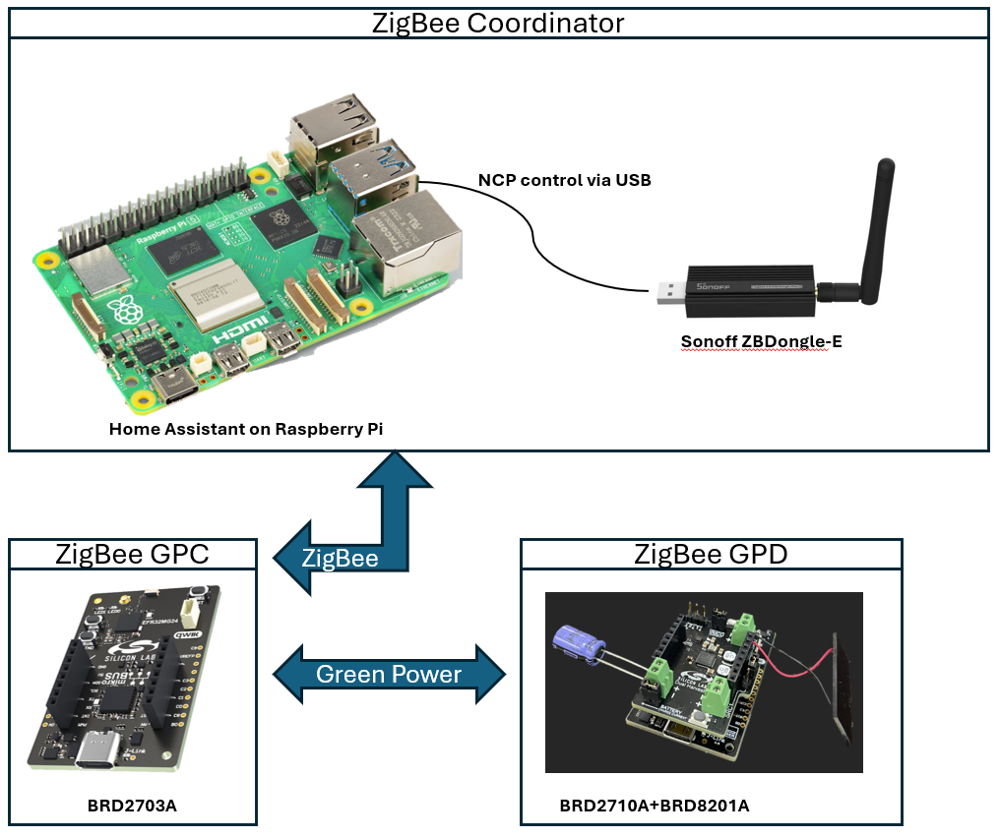

1. Follow [this article](https://sonoff.tech/product-review/how-to-use-sonoff-dongle-plus-on-home-assistant-how-to-flash-firmware/) to set up the Home Assistant with Raspberry Pi and Sonoff ZBDongle-E.

2. Navigate to the default URL of home assistant - http://homeassistant.local:8123/ and then find the integration Zigbee Home Automation.

   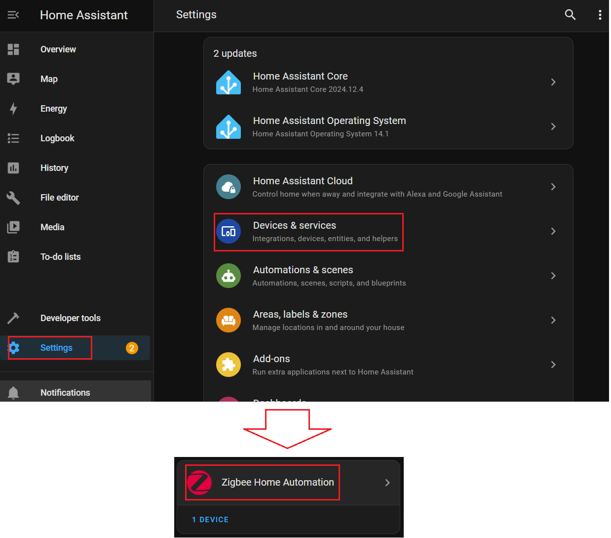

3. Follow the screenshots below to start searching for ZigBee devices

   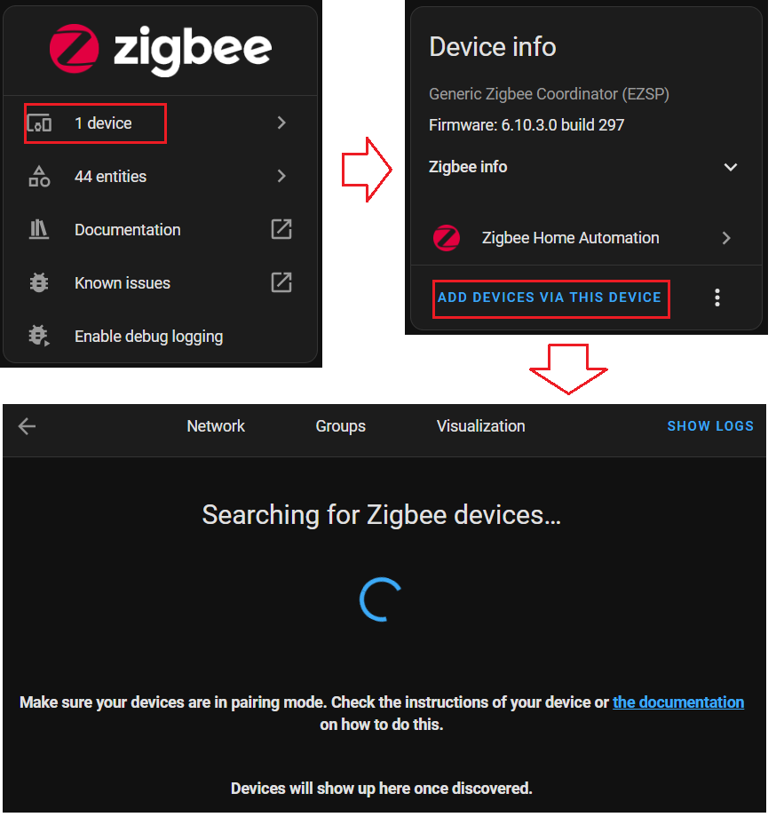

4. On GPC side, make sure LED0 is slowly blinking with 1 second interval which indicates its network is down. (Hold BTN1 over 2 seconds or issue the CLI command "network leave" to exit the original network if any.)

5. Press BTN1 or issue the CLI command "plugin network-steering start 0" to start network steering and then the GPC will appear in Home Assistant's page. Adjust the name and go back to Zigbee Home Automation integration.

   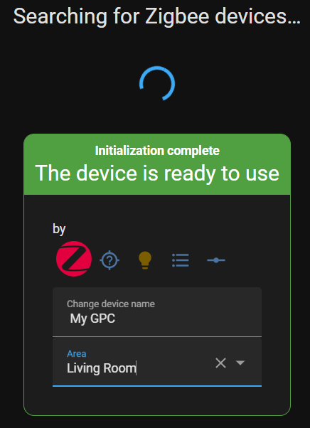

6. Follow the previous section "Test with Silabs GPC distributed network" to pair the GPD and GPC and monitor the Storage Voltage via GPC's debug log.

## Resources ##

- [Zigbee GPC - SoC Energy Harvesting Observer](https://github.com/SiliconLabs/energy_harvesting_applications/tree/main/example/zigbee_gpc_soc_energy_harvesting_observer)
- [UG103.15](https://www.silabs.com/documents/public/user-guides/ug103-15-green-power-fundamentals.pdf) Green Power Fundamentals
- [UG392](https://www.silabs.com/documents/public/user-guides/ug392-using-sl-green-power-with-ezp.pdf) Using Silicon Labs Green Power with Zigbee EmberZNet PRO
- [UG591](https://www.silabs.com/documents/public/user-guides/ug591-ek8200a-user-guide.pdf) User's Guide to EFR32xG22E Energy Harvesting Explorer Kit
- [Energy Harvesting Documentation](https://www.silabs.com/development-tools/wireless/efr32xg22e-explorer-kit?tab=overview)

**Note:** Methods for measuring current consumption specific to this hardware are discussed in the kit's User's Guide (UG591). Some example measurements are also provided in the same document.


## Report Bugs & Get Support ##

You are always encouraged and welcome to report any issues you found to us via [Silicon Labs Community](https://www.silabs.com/community)
