# Zigbee GPD - SoC Energy Harvesting Switch #

## Overview ##
This project demonstrates a ZigBee Green Power (GP) device powered entirely by an energy harvester, eliminating the need for batteries or other energy storage elements. With its reduced boot time, the wireless SoC operates using power harvested from a kinetic switch, rapidly waking up to send a report to a paired Green Power Combo (GPC) device. After successful commissioning, the Green Power Device (GPD) transmits toggle commands (GPDFs) to the GPC, enabling the control of an LED on the GPC.

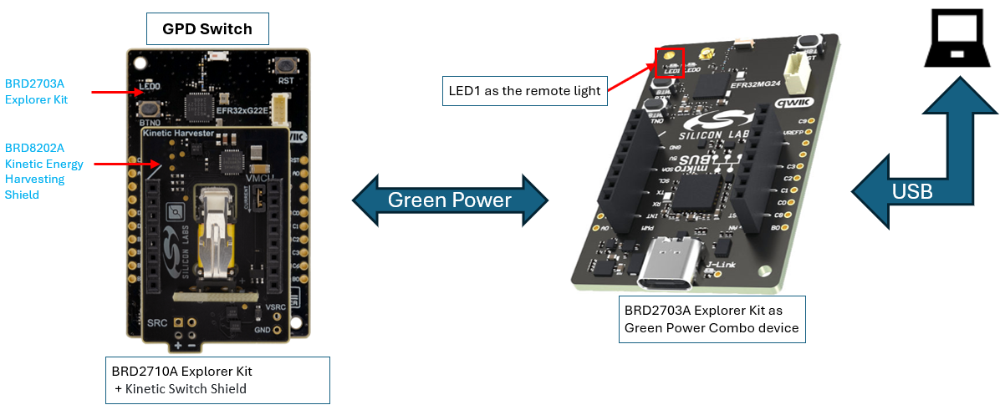

## Table of Contents ##

- [Zigbee GPD - SoC Energy Harvesting Switch](#zigbee-gpd---soc-energy-harvesting-switch)
  - [Overview](#overview)
  - [Table of Contents](#table-of-contents)
  - [Purpose/Scope](#purposescope)
    - [How It Works](#how-it-works)
      - [Commissioning](#commissioning)
      - [Operational](#operational)
      - [Decommissioning](#decommissioning)
  - [Prerequisites](#prerequisites)
    - [Hardware Requirements](#hardware-requirements)
      - [Hardware Connection](#hardware-connection)
    - [Software Requirements](#software-requirements)
  - [Steps to Run Demo Application](#steps-to-run-demo-application)
    - [Setup](#setup)
      - [Create a project based on an example project](#create-a-project-based-on-an-example-project)
    - [Testing](#testing)
      - [Test with Silabs GPC distributed network](#test-with-silabs-gpc-distributed-network)
      - [Preparing the observer](#preparing-the-observer)
      - [Commissioning](#commissioning-1)
      - [Decommissioning](#decommissioning-1)
      - [Test with a centralized Zigbee network](#test-with-a-centralized-zigbee-network)
      - [Preparing the observer](#preparing-the-observer-1)
  - [Resources](#resources)
  - [Report Bugs \& Get Support](#report-bugs--get-support)

## Purpose/Scope ##

ZigBee Green Power is a specialized feature of the ZigBee protocol designed for ultra-low-power, energy-harvesting devices, such as kinetic switches, that eliminate the need for traditional batteries or energy storage elements. Unlike standard ZigBee, Green Power uses short, efficient communication frames without acknowledgments (ACKs), minimizing data transmissions and energy consumption.

This solution uses Silicon Labs' EFR32MG22E system-on-chip (SoC), where a kinetic switch generates energy for Green Power frames through button-pushing. The ultra-low power design enables sustainable, maintenance-free performance and **Secure commissioning**, an alternative method to Out Of Band (OOB) methods is implemented here to provide an example of Secure Commissioning procedure, using GP protocol in energy constrained systems with normally disrupted supply. The Green Power state is stored in non-volatile memory (NVM) only after commissioning is complete to optimize energy efficiency.

Once commissioned, the kinetic switch generates Green Power Data Frames (GPDFs) to control the LED of a remote Green Power Combo (GPC) device, which is required to test the system.
- Green Power Combo device example project is available on GitHub as well - [**Zigbee GPC - SoC Energy Harvesting Observer**](https://github.com/SiliconLabs/energy_harvesting_applications/tree/main/example/zigbee_gpc_soc_energy_harvesting_observer)

### How It Works ###

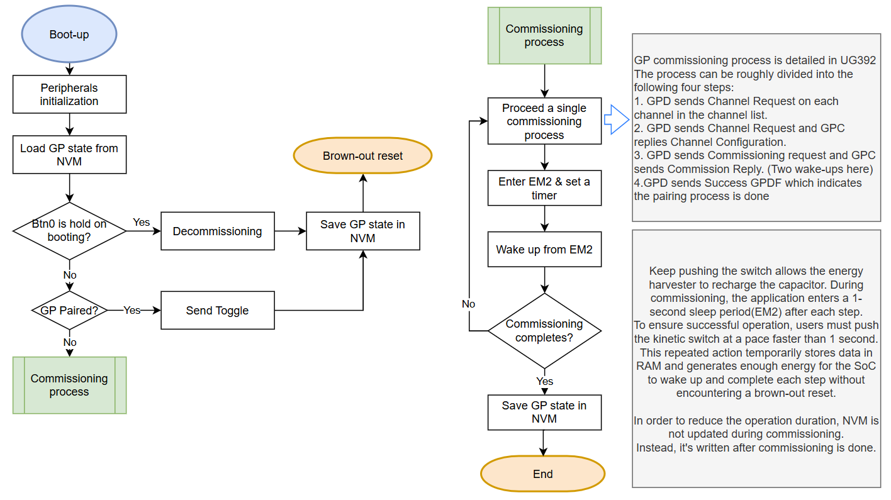

The application firmware operates as illustrated in the accompanying diagram and is designed for optimal energy efficiency in an energy-harvesting system. Unlike in battery-powered applications, the SoC is normally in a de-energized state and boots when the kinetic switch is pressed, i.e. when an energy pulse brings the system up. During normal operation, the SoC wakes up, sends toggle frames and remains idle until it runs out of power.

#### Commissioning ####

The commissioning process requires the user to repeatedly press the kinetic switch, for supplying the energy needed until the procedure has been completed. This is because secure commissioning involves steps with biderectional communication to set up radio channels, and exchange a security key. This implies turning the receiver ON and writing to non-volatile memory (NVM). Hence more energy is required compared to normal operation, when only unencrypted toggle frames are sent. The device performs a single Green Power (GP) commissioning step and then enters a power-saving mode to conserve energy and prevent power brownout. After approximately one second, the device wakes up to execute the next commissioning step. This cycle is repeated four times, until commissioning is completed. To further reduce power consumption, the device does not update the NVM during commissioning. Instead, the GP state is written to NVM only after the commissioning process is fully completed. This design optimizes energy efficiency while ensuring reliable operation in energy-harvesting scenarios.

**Important:** because the energy generated by a single push suffices for the execution of one step, but in most cases not two, the user is required to keep pushing the kinetic switch with shorter intervals than the sleep intervals, i.e. more often than once per second. After approximately 5 seconds, the commissioning procedure is normally completed and the GP state saved to NVM along with the security key.

Our solution adopts SECURE commissioning, eliminating the need for external batteries during the process or out-of-band (OOB) key exchange methods like code entry, QR code scanning, or mobile app interactions often used in BLE or NFC-based systems. While users need to push the switch for approximately 5 seconds, this approach avoids the higher costs and complexities of OOB commissioning. It also benefits vendors by removing the need to print unique codes or include additional hardware, making it a cost-effective and convenient win-win solution.

#### Operational ####

Once commissioning is complete, the GPD enters normal operational state. A single press of the kinetic switch is sufficient to generate a single Green Power toggling command (GPDF) and transmit it to the paired Green Power Combo (GPC) device. Continuous pressing of the switch is only required during the commissioning phase.

To minimize power consumption during commissioning, the non-volatile memory (NVM) is not updated incrementally. Instead, the GP state is written to NVM only in the following 3 cases - a) after the entire commissioning process is complete, b) decommissioning, and c) after sending Toggle command. Additionally, most peripherals are disabled to reduce power usage and shorten boot-up times. Direct NVM access is managed via the MSC (Memory System Controller) APIs, as the NVM3 mechanism is avoided due to its longer initialization time.

#### Decommissioning ####

No matter if the GPD is paired or not, keep Button 0 pressed on the GPD board during boot(i.e. pushing the switch) will initiate the decommissioning process.

**Note:** The SoC’s flash page erase time exceeds 10 ms, which significantly affects application execution time. To address this, the example avoids flash erasure entirely. Given that the GP state occupies only 32 bytes and the spare NVM space exceeds 320 kB, the NVM can be written more than 10,000 times without erasure.

## Prerequisites ##

### Hardware Requirements ###

- [xG22-EK8200A](https://www.silabs.com/development-tools/wireless/efr32xg22e-energy-harvesting-explorer-kit?tab=overview) - EFR32xG22E Energy Harvesting Explorer Kit
  - 1x [BRD2710A](https://www.silabs.com/development-tools/wireless/efr32xg22e-explorer-kit?tab=overview) - EFR32xG22E Explorer Board 
  - 1x BRD8202A - Kinetic Button Shield, with e-peas PMIC [AEM00300](https://e-peas.com/product/aem00300-ambient-energy-manager-battery-charger-pulsed/)

- [xG24-EK2703A](https://www.silabs.com/development-tools/wireless/efr32xg24-explorer-kit?tab=overview) EFR32xG24 Explorer Kit
  - 1x BRD2703A Explorer Kit Board

#### Hardware Connection ####

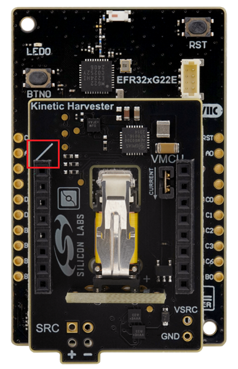

- Connect BRD2710A and BRD8202A together as the picture above. **Note:** The white line on the boards shall align

### Software Requirements ###

- Simplicity Studio
  - Download the [Simplicity Studio v5 IDE](https://www.silabs.com/developers/simplicity-studio)
  - Follow the [Simplicity Studio User Guide](https://docs.silabs.com/simplicity-studio-5-users-guide/1.1.0/ss-5-users-guide-getting-started/install-ss-5-and-software#install-ssv5) to install Simplicity Studio IDE
- [Simplicity SDK Version 2024.12.2](https://github.com/SiliconLabs/simplicity_sdk/releases/tag/v2024.12.2)
- [Energy Harvesting Applications Extension](https://github.com/SiliconLabs/energy_harvesting_applications), follow the [How to add to Simplicity Studio IDE](https://github.com/SiliconLabs/energy_harvesting_applications/blob/main/README.md#how-to-add-to-simplicity-studio-ide) to install the extension.

## Steps to Run Demo Application ##

### Setup ###

Please create a project in Simplicity Studio based on an example project to test this application

#### Create a project based on an example project ####

1. In Simplicity Studio from the Launcher Home, add BRD2710A to My Products, click on it, and click on the EXAMPLE PROJECTS & DEMOS tab. Find the example project with the filter "GPD" and "Switch".

2. Click Create button on the Zigbee GPD - SoC Energy Harvesting Switch example. Example project creation dialog pops up -> click Create and Finish and Project should be generated.

   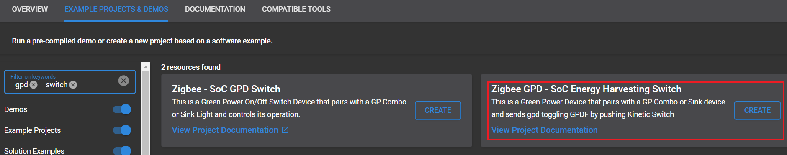

3. Check the software component "Green Power Device Application Support" which manages most configurations of a GPD.

   Apart from the field "GPD Application Channel Set" which will be discussed later, no modifications are required to pair this GPD example application with the GPC. However, if you plan to pair multiple GPDs with a single GPC simultaneously, ensure that each GPD has a unique Source ID and IEEE address to avoid conflicts.

   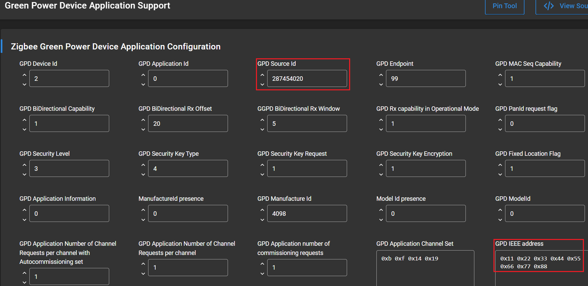

4. The limited power of Kinetic Switch is not sufficient to allow the GPD to send channel request at 16 channels. The channel number should be not more than 5.
   
   To achieve it, please open /config/gpd-apps-config.h and modify the two macros SL_ZIGBEE_AF_PLUGIN_APPS_APP_CHANNEL_SET and SL_ZIGBEE_AF_PLUGIN_APPS_APP_CHANNEL_SET_LENGTH. The comment above them shall be modified as well. Here is an example adjusting the GPD channel set to send Channel Request at channel 11, 15, 20, 24, and 25 only.

   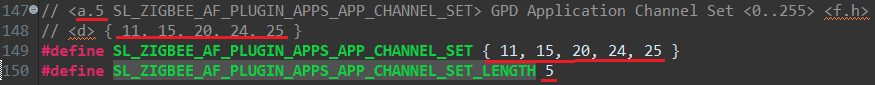
   
   While opening the software component Green Power Device Application Support, the channel set will be show present properly.

   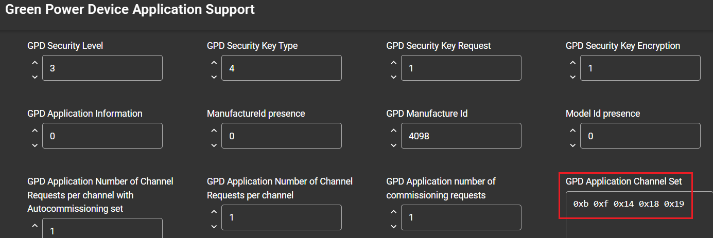

   Please also make sure the GPC's operating channel is included in GPD's channel set. Issue the CLI command "info" on GPC to get the channel information. If the GPC is not connected to a network, the channel value is shown as 0, which is an invalid value.

   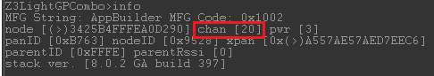

5. Some minor modifications in the SDK are required in order to copmlete the Channel Negotiation process. The changes are in \protocol\zigbee\app\gpd\plugin\apps\gpd-apps-commission.c under the project workspace so the native SDK is not impacted.

   No actions required. However, to view the changes, search for the macro KINETIC_SWITCH_GP_CHANNEL_REQUEST in gpd-apps-commission.c.
   
   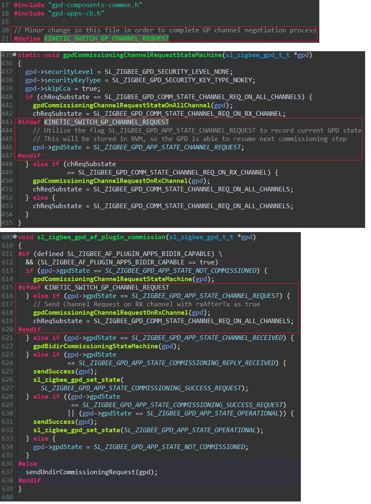

6. Build and flash the examples to the board.
   > **_NOTE_:** When creating your own project, please pay attention to the initialization sequence in app_init(). It should follow the same order as in the example project as below.
   ```c
   // Initialize NV
   sl_zigbee_gpd_nv_init();

   // Provide the rail handle from the configured RAIL instance
   sl_zigbee_gpd_rail_provide_rail_handle(sl_rail_util_get_handle(
                                           SL_RAIL_UTIL_HANDLE_GPDRAIL));
   
   // Initialize Radio
   sl_zigbee_gpd_radio_init();

   // Initialize the GPD
   sl_zigbee_gpd_init();
   ```

**Note:**

- The bootloader is **not** required for this example.

- If the BRD2710A has ever been tested with other project, please fully erase the flash before programming the GPD image.
  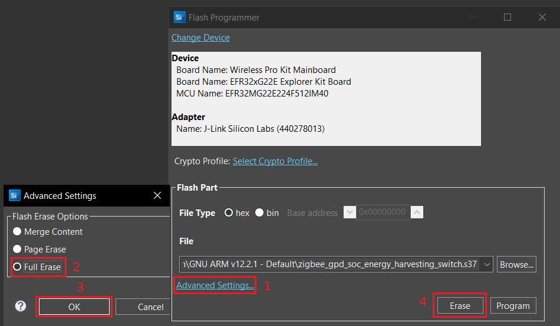

- For GPC, refer to [**Zigbee GPC - SoC Energy Harvesting Observer**](https://github.com/SiliconLabs/energy_harvesting_applications/tree/main/example/zigbee_gpc_soc_energy_harvesting_observer) to create a GPC observer project.


### Testing ###

To test the GPD switch, it is necessary to pair it to a GPC device in a Zigbee network, either a distributed network or a centralized network. The following diagram summarizes the machine states of the GPD switch and GPC observer from a high level perspective and can be useful to refer while reading the steps described in next section. 
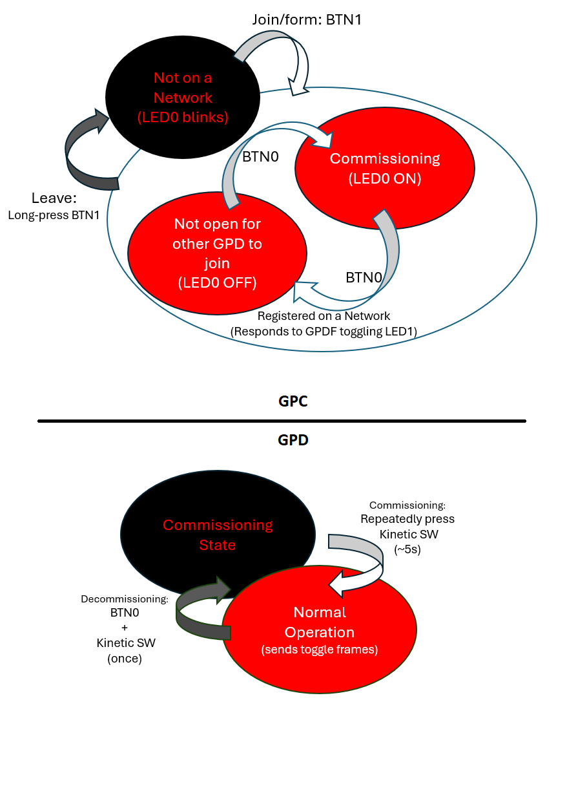 
#### Test with Silabs GPC distributed network ####

After flashing the code to the target device and mounting BRD8202A onto BRD2710A explorer kit, the application is ready for the test.
In order to reduce the power consumption, most peripherals including IO Stream have been disabled. Hence, the GPD doesn't have the capability of printing debug message. However, the GPC can provide useful information about the packets being exchanged through its serial port. Connect the GPC to the computer with a USB cable, open a terminal and check the log  node to debug states and exchange of ZGP packets. The GPC's  virtual COM port (VCOM), has default serial configuration set to a baud rate of 115200, no parity, one stop bit, and no hardware flow control. Next, unplug the GPD and attach the energy harvester shield.

**Please note:** When programming the firmware of the GPD, it must be connected to a PC via a USB cable, which provides power to the device. After the firmware is flashed, the GPD automatically initiates commissioning and attempts to pair with any nearby GPC in commissioning mode.
To prevent unintended pairing, either power off the GPC or ensure it exits commissioning mode before flashing the firmware to the GPD.
If the GPC device (observer) is not on a network (LE0 slowly blinking), press BTN1 or issue the command "plugin network-steering start 0" to form a distributed network with the GPC device. Note that power cycling  or reflashing should not affect the network state, so this step is typicaly needed the first time after unboxing the GPC, full-erasing memory or after leaving a network (long press BTN1).
#### Preparing the observer ####
Make sure the GPC has formed a distributed network. If LED0 is blinking, it indicates the GPC's network is not ready, check GPC observer project for more information.

#### Commissioning ####

1. Press BTN0 on the GPC end (BRD2703A) to enter commissioning state. When the GPC application is in commissioning state, LED0 remains on. If LED0 is blinking, it indicates the GPC's network is not ready, check GPC observer project for more information.

   **Optional:** While entering commissioning mode, the GPC outputs the debug message below which be captured using any serial port tool.
   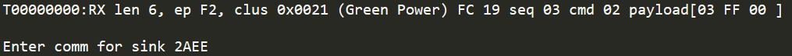

2. Pressing switch on GPD **repeatedly** at the interval shorter than 1 second until the commissioning process is done. This is normally accomplished in about 5 seconds, when continuous operation is correctly sustained during the process. Refer to section 3.2 Bidirectional Commissioning in [UG392](https://www.silabs.com/documents/public/user-guides/ug392-using-sl-green-power-with-ezp.pdf) for details of the commissioning process.

   **Optional:** Observe the commissioning process via the debug messages sent by GP Combo device.
   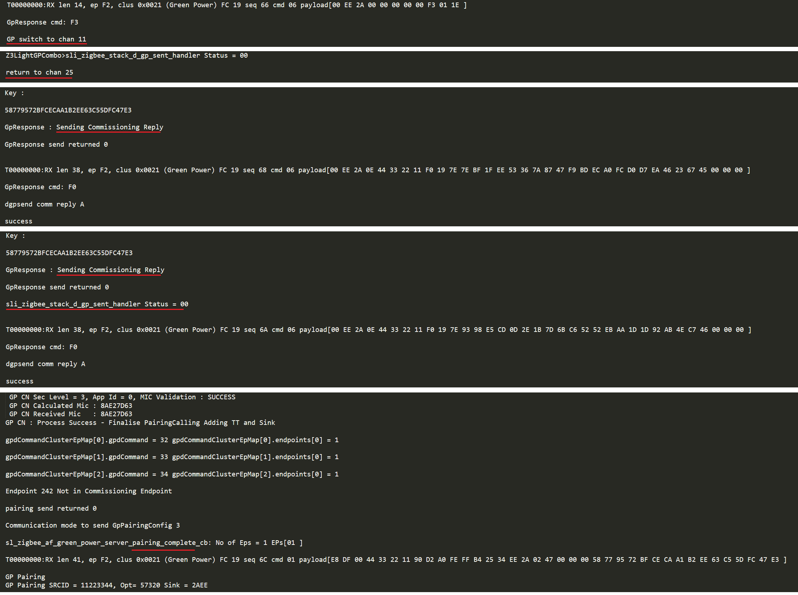

3. Once the GPD pairs with GPC, pushing the switch will generate the command to toggle LED on the GPC. This allows users to confirm successful commissioning by simply observing LED1 without checking debug messages. If the commissioning process is successful, LED1 will toggle in response to activations of the GPD kinetic switch, with a brief delay due to the GPC’s de-bouncing mechanism, which prevents toggling within one second. This confirms that the commissioning process completes and GPD is transmitting toggle frames as expected during normal operation.


   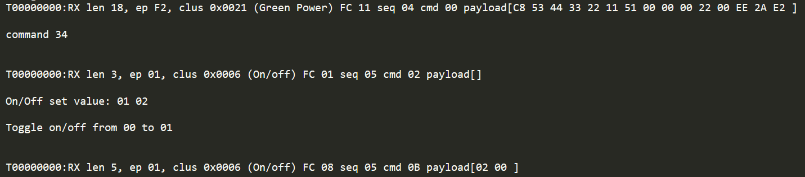

#### Decommissioning ####

To initiate decommissioning from GPD, keep Button 0 pressed on the GPD board during boot(i.e. pushing the switch). The GP Combo device will receive the packet and the debug messages below will be printed.

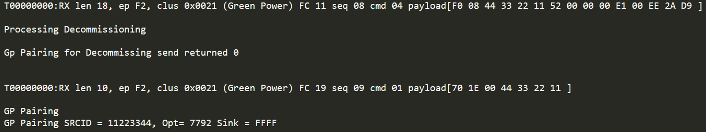

After decommissioning, the GPD shall not exist in the GPC's proxy table. Issue the CLI command **plugin green-power-client print-proxy-table** on GPC to check it. The CLI command **plugin green-power-client clear-proxy-table** empty the proxy table.
**Note:** If the GPC leaves the network on which the GPD is registered, it will need to execute decommissioning before it can start a new commissioning process. A  typical case  is when users  test a distributed network first, and the turn it down  to join an existing Zigbee network as explained in next section.

#### Test with a centralized Zigbee network ####

This example also demonstrates how to join the GBC to Home Assistant system running on Raspberry Pi with a ZigBee dongle Sonoff ZBDongle-E.
**Note:** The following steps are optional and explain how to alternatively set-up the GPC to join a centralized network instead of forming its own distributed network as in the previous section
#### Preparing the observer ####
Make sure the GPC has NOT formed a distributed network. If LED0 is blinking, you are all set. Please check GPC observer project for more information.

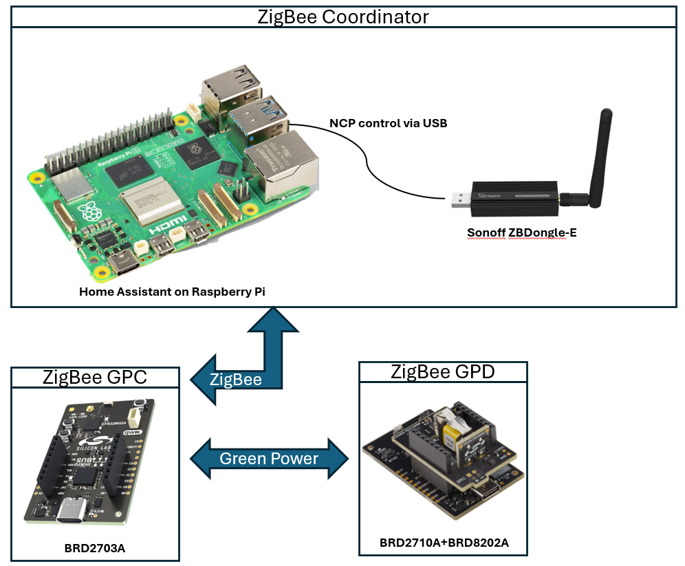

1. Follow [this article](https://sonoff.tech/product-review/how-to-use-sonoff-dongle-plus-on-home-assistant-how-to-flash-firmware/) to set up the Home Assistant with Raspberry Pi and Sonoff ZBDongle-E.

2. Navigate to the default URL of home assistant - http://homeassistant.local:8123/ and then find the integration Zigbee Home Automation.

   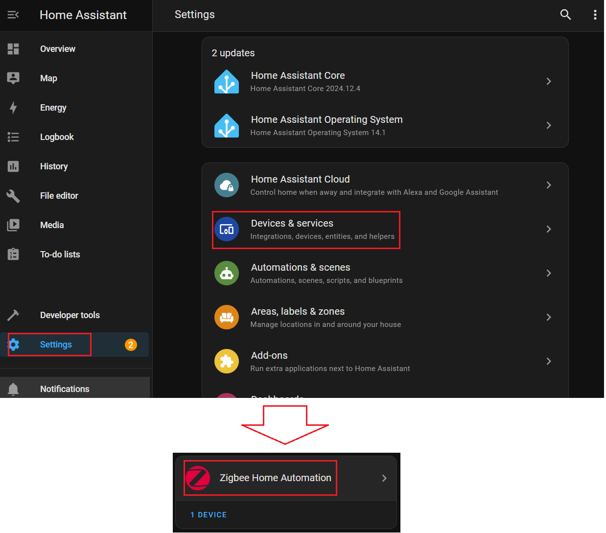

3. Follow the screenshots below to start searching for ZigBee devices

   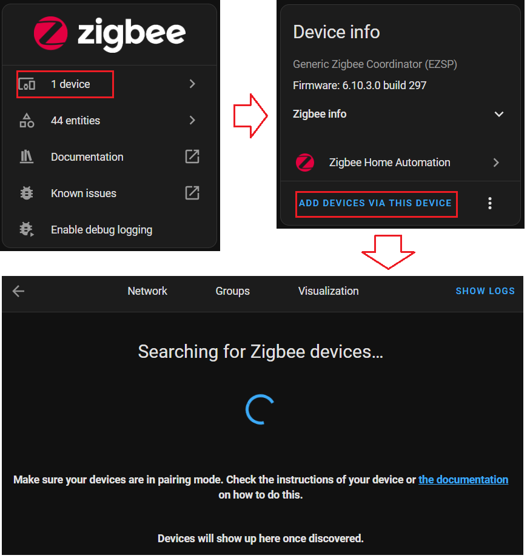

4. On GPC side, make sure LED0 is slowly blinking with 1 second interval which indicates its network is down. (Hold BTN1 over 2 seconds or issue the CLI command "network leave" to exit the original network if any.)

5. Press BTN1 or issue the CLI command "plugin network-steering start 0" to start network steering and then the GPC will appear in Home Assistant's page. Adjust the name and go back to Zigbee Home Automation integration.

   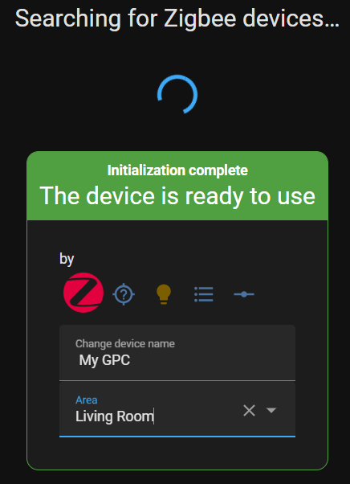

6. Repeat the steps of the previous section, "Test with Silabs GPC distributed network", to pair the GPD and GPC again.

7. Navigate to the device page of the newly added GPC device, following the steps below. The light status is shown in the page. Toggling the light using the kinetic switch (GPD) will immediately toggle the light state seen though the Home Assistant integration.

   **Note:** The GPD does not really support ZigBee features, and it's not shown in the device list.
   
   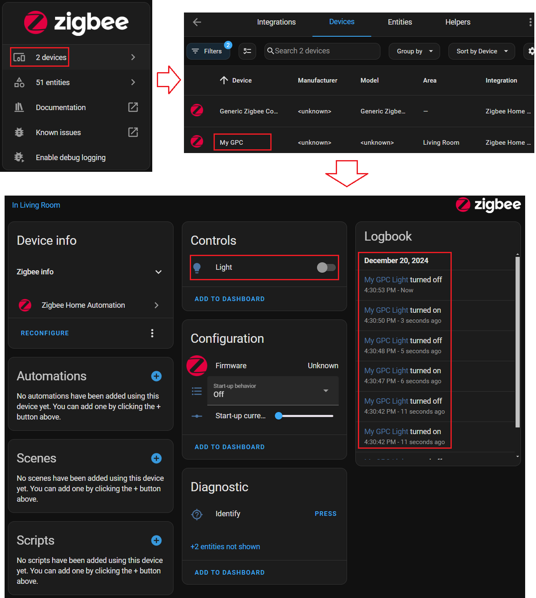

## Resources ##

- [Zigbee GPC - SoC Energy Harvesting Observer](https://github.com/SiliconLabs/energy_harvesting_applications/tree/main/example/zigbee_gpc_soc_energy_harvesting_observer)
- [UG103.15](https://www.silabs.com/documents/public/user-guides/ug103-15-green-power-fundamentals.pdf) Green Power Fundamentals
- [UG392](https://www.silabs.com/documents/public/user-guides/ug392-using-sl-green-power-with-ezp.pdf) Using Silicon Labs Green Power with Zigbee EmberZNet PRO
- [UG591](https://www.silabs.com/documents/public/user-guides/ug591-ek8200a-user-guide.pdf) User's Guide to EFR32xG22E Energy Harvesting Explorer Kit
- [Energy Harvesting Documentation](https://www.silabs.com/development-tools/wireless/efr32xg22e-explorer-kit?tab=overview)

**Note:** Methods for measuring current consumption specific to this hardware are discussed in the kit's User's Guide (UG591). Some example measurements are also provided in the same document.

## Report Bugs & Get Support ##

You are always encouraged and welcome to report any issues you found to us via [Silicon Labs Community](https://www.silabs.com/community)
